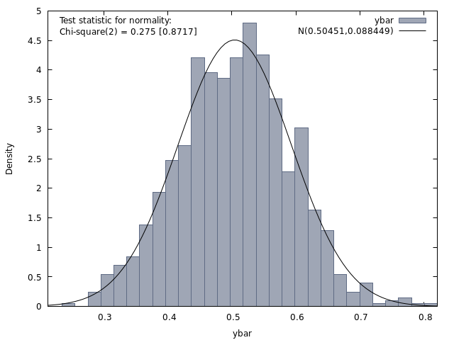
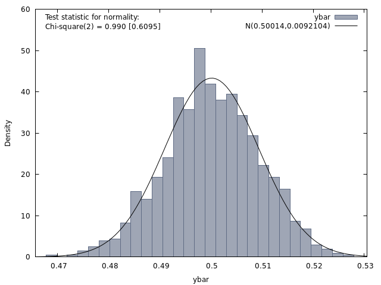

# `gretl` Notes
## Week 2
### Module 1 Week 2
Open up a new script editor: `File` -> `Script files` -> `New script` -> 
`gretl script`
### Binomial Distribution
- $n$ independent trials, each trial was either a "success" or a "failure";
- $p$ is the probability of success and $1-p$ is the probability of failure;
- the $n$ trials are independent
- $X \sim B(n, p)$
1. We have a class of 50 students. They can either pass or fail an
  exam. Probability of passing is 0.63:
```
# Probability of exactly 25 students passing the exam:
# `b` - is binomial distribution
scalar binom25 = pdf(b, 0.63, 50, 25)
print binom25 
```
  - Output:
```
? scalar binom25 = pdf(b, 0.63, 50, 25)
Generated scalar binom25 = 0.0195137
? print binom25

        binom25 =  0.019513733
```
- Answer: probability of exactly 25 students passing is `0.019513733`
2. Probability that fewer than 30 students pass the exam:
- Recall: *CDF* gives the $\mathbb{P}(X \leq x = 30)$
```
scalar binom30less = cdf(b, 0.63, 50, 30) - pdf(b,.63, 50, 30)
print binom30less
```
- Output:
```
? scalar binom30less = cdf(b, 0.63, 50, 30) - pdf(b,.63, 50, 30)
Generated scalar binom30less = 0.276387
? print binom30less

    binom30less =  0.27638679
```
- Answer: probability that fewer than 30 students pass the exam is `0.27638679`.
1. Probability that more than 30 students pass the exam?
- Recall: can exploit the definition of the $CDF$: $\mathbb{P}(X \leq x = 30)$
```
scalar binom30more = 1 - cdf(b, 0.63, 50, 30)
print binom30more
```
- Output:
```
? scalar binom30more = 1 - cdf(b, 0.63, 50, 30)
Generated scalar binom30more = 0.619492
? print binom30more

    binom30more =  0.61949154
```
- Answer: probability is equal to `0.61949154`.
4. Produce a $PMF$ graph of the $X \sim B(n=50, p=.63)$:
- Using the GUI:
  - `Tools` -> `Distribution graphs` -> `binomial` tab -> `0.63` in `Prob` 
   and `50` in `trials` -> `Ok`
- The graph demonstrates why it's appropriate to approximate the *Binomial 
 Distribution* with a *Normal Distribution*.

### Poisson Distribution
- helpful model for a *Random Variable* of number of occurrences of event in 
  fixed time or space interval
- Parameter is the mean number of occurrences $\lambda$
- $X \sim P(\lambda)$
- Example: How many times an Amazon truck drives down my street every day, if we know the mean number of times is 12 per day?
  - $X \sim P(12)$
1. Probability that 10 Amazon trucks drive down my street in a day:
```
scalar pois10trucks = pdf(p, 12, 10)
print pois10trucks
```
- Output:
```
? scalar pois10trucks = pdf(p, 12, 10)
Generated scalar pois10trucks = 0.104837
? print pois10trucks

   pois10trucks =  0.10483726
```
- Answer: `0.10483726`
2. Probability that 20 Amazon trucks drive my street:
```
scalar pois20trucks = pdf(p, 12, 20)
print pois20trucks
```
- Output:
```
? scalar pois20trucks = pdf(p, 12, 20)
Generated scalar pois20trucks = 0.00968203
? print pois20trucks

   pois20trucks =  0.0096820322
```
  - Answer: `0.0096820322`
3. Probability that more than 15 trucks drive down my street?
```
scalar pois15more = 1 - cdf(p, 12, 15)
print pois15more
```
- Output:
```
? scalar pois15more = 1 - cdf(p, 12, 15)
Generated scalar pois15more = 0.155584
? print pois15more

     pois15more =  0.15558435
```
- Answer: `0.15558435`
4. Produce a $PMF$ graph of the $X \sim Pois(\lambda=12)$:
   - `Tools` -> `Distribution graphs` -> `poisson` tab -> `12` in `mean` -> `Ok`

### Continuous Uniform Distribution
- No special commands needed, because *PDF* is $\frac{1}{b-a}$ and *CDF* is $\frac{x-a}{b-a}$
- Say $X \sim U(11, 22)$
1. Probability of an arbitrary value between $15$ and $18$ :
```
eval (18 - 15) * (1 / (22 - 11))
```
- Output:
```
? eval (18 - 15) * (1 / (22 - 11))
0.27272727
```
- Answer: `0.27272727`

### Normal Distribution
- Example: IQ scores are normally distributed with a *Mean* of $100$ and a *Standard Deviation* of 15 (*Variance* $= 15^2 = 225$).
  - $X \sim N(100, 225)$
  - Recall: probability of a single value $= 0$
1. What is the probability that someone has an IQ greater than 150?
2. What is the probability that someone has an IQ less than 80?
3. What is the probability that someone has an IQ between 90 and 120?

```
# Convert to z-scores:
scalar z1 = (150 - 100) / 15
scalar z2 = (80 - 100) / 15
scalar z3 = (90 - 100) / 15
scalar z4 = (120 - 100) / 15

scalar iqmore150 = 1 - cdf(z, z1)
scalar iqless80 = cdf(z, z2)
scalar iqbtw90_120 = cdf(z, z4) - cdf(z, z3)
```
- Output:
```
? scalar z1 = (150 - 100) / 15
Generated scalar z1 = 3.33333
? scalar z2 = (80 - 100) / 15
Generated scalar z2 = -1.33333
? scalar z3 = (90 - 100) / 15
Generated scalar z3 = -0.666667
? scalar z4 = (120 - 100) / 15
Generated scalar z4 = 1.33333
? scalar iqmore150 = 1 - cdf(z, z1)
Generated scalar iqmore150 = 0.00042906
? scalar iqless80 = cdf(z, z2)
Generated scalar iqless80 = 0.0912112
? scalar iqbtw90_120 = cdf(z, z4) - cdf(z, z3)
Generated scalar iqbtw90_120 = 0.656296
```
- Answer:
  - 1. `0.00042906`
  - 2. `0.0912112`
  - 3. `0.656296`
4. Produce a $PDF$ graph of the $X \sim N(\mu=100, \sigma^2 = 225)$:
   - `Tools` -> `Distribution graphs` -> `normal` tab -> `100` in `mean`, `15` in `std. deviation` -> `Ok`

### Point-and-Click
`Tools` -> `p-value finder`

### Graphing Curves
Example: `Tools` -> `Plot a curve` -> `formula`: `5 + 10 * x - 0.05 * x**2`; `x minimum`: `0`; `x range`: `200` -> `Ok`

### Central Limit Theorem
- A *Mean* of *Random Samples* is *Normally Distributed*
1. Create a set of 10 observations drawn from a *Uniform Distribution* with $a = 0$ and $b = 1$
1. Calculate the sample average.
2. Do this 1000 times.
3. Plot all 1000 sample averages. According to the *CLT*, this will be *Normal*.

```bash
nulldata 10  # Create a dataset of 10 observations
set seed 123456  # Allows to replicate the same random draws
loop 1000 --progressive --quiet  # --quiet keeps the output in the background
  series yt = uniform()  # No parameters, because a = 0 and b = 1 by default; draws 10 observations from a Uniform Distribution
  scalar ybar = mean(yt)  # Calculate the mean of the 10 observations, and store in a ybar variable
  store clt.gdt ybar  # Stores variable ybar in a dataset file called clt.gdt
endloop

open clt.gdt  # Open the saved file
freq ybar --plot=display --normal  # plot the means; --normal overlays a normal curve
```
- Output: 


1. Same thing, but drawing 1000 observations from *Uniform Distribution* (and save to a different filename):
```bash
nulldata 1000  # Create a dataset of 10 observations
set seed 123456  # Allows to replicate the same random draws
loop 1000 --progressive --quiet  # --quiet keeps the output in the background
  series yt = uniform()  # No parameters, because a = 0 and b = 1 by default; draws 10 observations from a Uniform Distribution
  scalar ybar = mean(yt)  # Calculate the mean of the 10 observations, and store in a ybar variable
  store clt2.gdt ybar  # Stores variable ybar in a dataset file called clt.gdt
endloop

open clt2.gdt  # Open the saved file
freq ybar --plot=display --normal  # plot the means; --normal overlays a normal curve
```
- Output: 

  - Even closer to a *Normal Distribution*, but even with `10` observations, it was already pretty close.