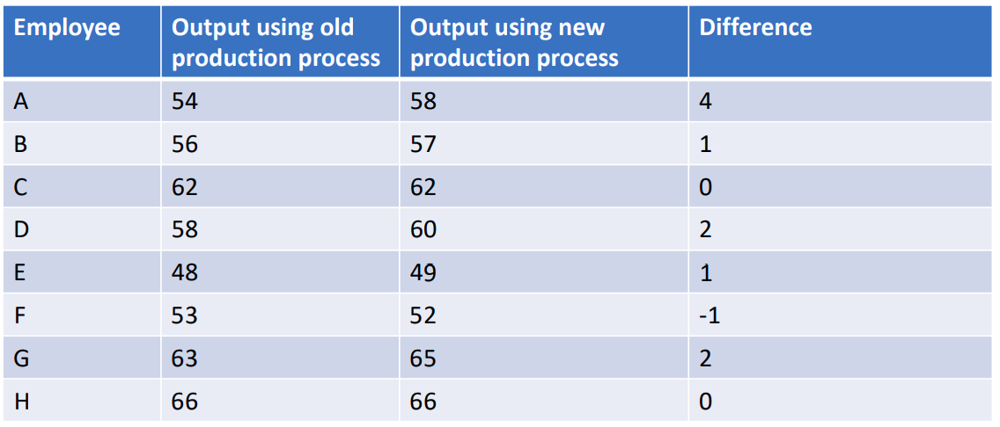

$$
\newcommand{\pr}{\text{I\kern-0.15em P}}
\newcommand{\Ha}{H_a}
\newcommand{\Ho}{H_0}
\newcommand{\pv}{\text{p-value}}
$$

# Notes

## Week 4
### Module 2 Week 4A
#### Hypothesis Testing II
##### Hypothesis testing with two samples
- E.g.:

    - We are often interested in making comparison between groups.

    - Is there a difference in average salary between male and female lawyers?

    - Is there a difference in the proportion of times students are late to class
      between public and private colleges?

    - Is there a difference in the average price of a 4-star hotel room between
      Washington DC and Baltimore?

    - Is there a difference in the proportion of households with Internet access
      between those living in the North versus those living in the South?

- We will almost always calculate a difference using random samples, **what
  we want to know** is whether this is a *true difference* or simply due to random chance. 

  

- The two groups can be *independent* or *matched pairs*

  - **Independent groups** consist of two samples from two independent
  populations (e.g. population 1 is female and population 2 is male)
  - **Matched pairs** are two samples that are *dependent* (e.g. completion time
    before training and completion time after training).

- All that is really changing compared to hypothesis testing with one
  mean is the type of question being asked. The approach to the test
  will be the same.

  - *Set up hypothesis, determine distribution, calculate test statistic and p-value,*
  *make decision*.

  

  ###### Difference in Two Means
  
- We know, thanks to the *CLT*, that the distribution of a mean is normal. It is also true that
  the distribution of *differences* in means is normal.

- For **differences in means** the *standard error* is estimated by: $SE = \sqrt{\frac{s_1^2}{n_1} + \frac{s_2^2}{n_2}}$

    - Another alternative: SE using *Pooled Variances*, but assumes equal population variances, which is unlikely and difficult to verify => stick with the SE above.

- The *t-stat* is still the difference between our estimate and the value being tested (i.e. the value specified in $H_0$ ) divided by the standard error.
  - If $H_0$ is true (which is assumed) how many *standard deviations* is our estimate from the mean?
  - *t-stat* $= \frac{(\bar{X}_1 - \bar{X}_2) - (\mu_1 - \mu_2)}{\sqrt{\frac{s_1^2}{n_1} + \frac{s_2^2}{n_2}}}$ 
  - *Degrees of freedom* $= \frac{(\frac{s_1^2}{n_1} + \frac{s_2^2}{n_2})^2}{(\frac{1}{n_1 - 1}) (\frac{s_1^2}{n_1})^2 + (\frac{1}{n_2 - 1}) (\frac{s_2^2}{n_2})^2}$ 

  

- E.g. Is there a difference in the average price of a 4-star hotel room between Washington DC and Baltimore? 

  - Denote Washington DC group 1 and Baltimore group 2
  - Suppose we have the following sample statistics: 
    - $\bar{X}_1 = 290$, $\bar{X}_2 = 270$, $n_1 = 30$, $n_2 = 22$, $s_1 = 40$, $s_2 = 32$ 
    - $H_o$: $\mu_1 - \mu_2 = 0$ 
    - $H_a$ : $\mu_1 - \mu_2 \neq 0$ 
    - *t-stat* $= \frac{(290 - 270) - (0)}{\sqrt{\frac{1600}{30} + \frac{1024}{22}}} = \frac{20}{\sqrt{99.88}} = 2$, i.e. the observed difference in means is 2 SD's away from the Null value of 0.
    - $DOF = 49.57 \approx 49$ <- *round DOWN to be safer!*
    - $\pv = 0.051$ 
    - $0.051 > 0.05$ => fail to reject $\Ho$, there is not a statistically significant difference between Washington DC and Baltimore in the average price of a hotel room. *Note: finding a statistically significant difference or effect does NOT mean we found an IMPORTANT difference or effect.*

  

  ###### Difference in Two Proportions (Independent Samples)

- A similar approach is used for testing differences in *population proportions*. 

    - *Assume*: two independent random samples with at least 5 “successes” and 5 “failures” in each sample. 
        - Literature shows: the population should be at least 10-20 larger than the sample => prevents oversampling
    - *Differences in proportions* follow a *normal distribution*. 
    - A *”pooled proportion”* is used to conduct the test.
        - $p_c = \frac{x_a + x_b}{n_a + n_b}$; where $x_a = \text{number of successes in 1st group}$ and $x_b = \text{number of successes in 2nd group}$
        - $(p'_a - p'_b) \sim N(Mean = 0, Var = p_c(1 - p_c) (\frac{1}{n_a} + \frac{1}{n_b})$ (under the $\Ho$ )
        - $\text{z-stat} = \frac{(p'_a - p'_b) - (p_a - p_b)}{\sqrt{p_c(1 - p_c) (\frac{1}{n_a} + \frac{1}{n_b})}}$ where $SE = \sqrt{p_c(1 - p_c) (\frac{1}{n_a} + \frac{1}{n_b})}$

- E.g. Is there a difference in the proportion of households with Internet access between those living in the North versus the South? 
    - Denote North group a and South group $b$
    - Suppose we have the following sample statistics: 
        - $p'_a = 0.74$, $p'_b = 0.68$, $n_a = 42$, $n_b = 38$, $p_c = \frac{31 + 26}{42 + 38} = 0.71$ 
        - $\Ho$: $p_a  - p_b= 0$
        - $\Ha$: $p_a  - p_b \neq 0$
        - $\text{z-stat} = \frac{(0.74 - 0.68) - (0)}{\sqrt{(0.71) (1 - 0.71) (\frac{1}{42} + \frac{1}{38})}} = \frac{0.06}{\sqrt{0.0103}} = 0.59 $, i.e. observed difference in proportions is 0.59 SD's away from the $\Ho$ value of no difference
        - $\pv = 0.556 (= 0.278 \times 2)$
        - $0.556 > 0.05$ => fail to reject $\Ho$, there is not a statistically significant difference between the proportion of households with Internet access in the North versus the South. 

    

    ###### Difference in Two Proportions (Matched samples)

- E.g. Does a new production process increase output produced, on average? 
    

    - *Assume:* Matched pairs; have differences that come from a Normal population OR the sample is *large* enough to make the distribution *approximately normal* 
      
    - The average difference $= \bar{X}_d = 1.125$
      
    - The standard deviation of the difference $= s_d = 1.55$ 
      
    - This test is conducted using a *Student’s t-distribution with $(n − 1)$ Degrees of Freedom*
        - $\Ho$: $\mu_d = 0$ 
        - $\Ha$: $\mu_d > 0$ 
        - $\text{t-stat} = \frac{\bar{X}_d - \mu_d}{s_d / \sqrt{n}} = \frac{1.125 - 0}{1.55 / \sqrt{8}} = 2.05$
        - *One Tailed:* $\pv = 0.0398 < 0.05$ =>  reject $\Ho$, the new production process increases output produced. 
