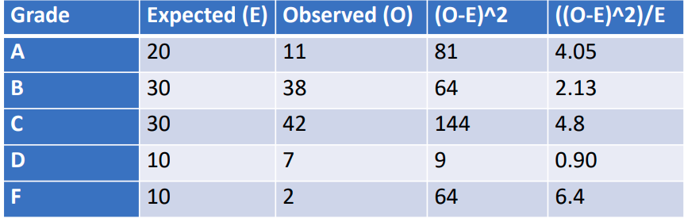
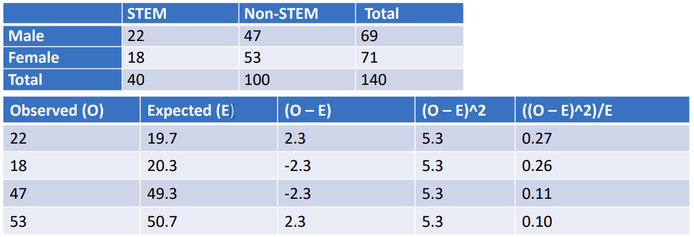
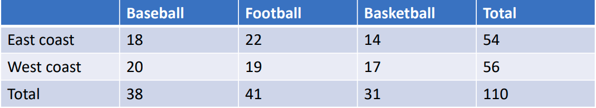
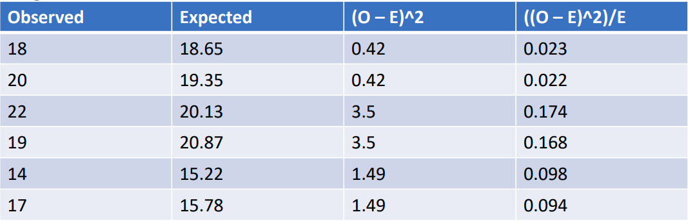

$$
\newcommand{\pr}{\text{I\kern-0.15em P}}
\newcommand{\Ha}{H_a}
\newcommand{\Ho}{H_0}
\newcommand{\pv}{\text{p-value}}
\newcommand{\ss}{\sum_{i=1}^{n}}
$$

# Notes

## Week 4
### Module 2 Week 4B
#### Chi-Squared Tests
- The Chi-squared distribution is a member of the normal family of distributions and often arises as the sampling distribution for a test statistic. 
- We will use the Chi-squared distribution for: 
    - *Goodness of fit tests*
    - *Tests of independence*
    - *Tests of homogeneity*
    - *Tests of a single variance*
- A Chi-squared distribution has a *mean* equal to $df$ and *standard deviation* equal to $\sqrt{2df}$ 
- A Chi-squared random variable with $k$ degrees of freedom is the sum of $k$ independent, squared standard normal distributions.
    - => The *Test Statistic* $\geq 0$, *never negative*!

- A Chi-squared distribution is *skewed to the right* and the skew decreases as $df$ increases.
- A Chi-squared distribution with $df > 90$ can be approximated with a *Normal Distribution*.

##### Goodness of fit test 

- Do the data fit a particular distribution?
- Often used for *categorical data*
- $\Ho$: data fit the expected distribution 
- $\Ha$: data do not fit the expected distribution
- The test involves comparing expected frequencies ($E$) with observed frequencies ($O$).
- Let $k =$ the number of categories of the variable of interest
- Test statistic $= \sum_k \frac{(O - E)^2}{E}$
- The test is *always right-tailed*.
- $df = k – 1$
- Want *Expected Value* for each category $\geq 5$

    - E.g. The following table shows the distribution of grades a professor expects in a class of 100 students as well as the grades she observes.

        - 
        
        - Test-stat $= 4.05 + 2.13 + 4.8 + 0.90 + 6.4 = 18.28$
        - $df = k – 1 = 5 – 1 = 4$
        - $\pv = 0.0011$
        - $0.0011 < 0.05$ => reject $\Ho$, the observed grades do not fit the expected distribution

##### Test of independence 

- Are two variables independent (i.e. knowing values for one variable of interest doesn't give you information about other variable's values)? 

- Often used for *nominal variables* 

- $\Ho$: the two variables are independent 

- $\Ha$: the two variables are not independent 

- Test statistic $= \sum_k \frac{(O - E)^2}{E}$

- $df = (\text{number of rows} – 1)\times (\text{number of columns} – 1)$

- Expected frequencies ( $E$ ) won’t always be obvious.

    - Calculate using $\frac{(\text{row total}) \times (\text{column total})}{(\text{total number of observations})}$  
    - Row and column totals are often referred to as row and column *marginals*

    

- E.g. Is there a relationship between gender and being a STEM major?

    - 

    - $\text{Test-stat} = 0.27 + 0.26 + 0.11 + 0.10 = 0.74$

    - $df = (2 – 1) \times (2 – 1) = 1$ 

    - $\pv = 0.39$ 

    - $0.39 > 0.05$ => fail to reject $\Ho$, gender and being a STEM major are independent

##### Test for homogeneity

- *Motivation*: The goodness of fit test is used to determine if the data fit a *particular* distribution, but it won’t suffice for determining whether two variables follow the same *unknown* distribution.

- $\Ho$: distributions are the same 

- $\Ha$: distributions are different 

- Test statistic is calculated in same way as for the goodness of fit test. 

- $df = \text{number of columns} – 1$ 

- Comparing a single qualitative variable with more than 2 categories across two populations 

- All values in table must be greater than or equal to 5

    

- E.g. Is there a difference in favorite professional sport to watch between those living on the east coast versus the west coast?

    - 
    - 

- $\text{Test-statistic} = 0.023 + 0.022 + 0.174 + 0.168 + 0.098 + 0.094 = 0.579$
- $\pv = 0.749$ 
- $0.749 > 0.05$ => fail to reject $\Ho$, there is not a statistically significant difference between east and west coast in the distribution of favorite pro sports

##### Test of a single variance

- *Assume* underlying population is *normal* 
- Can still have *One* or *Two-Tailed* test for a Single Variance (but the Test Stat is still *positive*)
- E.g. Is the variance in waiting time at the DMV greater than 10 minutes? 
    - $\Ho$: $\sigma^2 = 10$ (Note the *Equal* sign: because the Sampling Distribution is under the assumption that the Null Hypothesis is true => a *Single* distribution; an Inequality sign would imply infinite number of distributions => "$=$" is more accurate in $\Ho$ than "$\geq$" or "$\leq$")
    - $\Ha$: $\sigma^2 > 10$
    - $\text{Test-statistic} = \frac{(n - 1) s^2}{\sigma^2}$, where $s^2$ - *Sample Variance*
    - $df = n – 1$ 
    - Suppose in a random sample of 30 people at the DMV the sample variance is calculated and equal to 12. 
    - $\text{Test-statistic} = \frac{29 \times 12}{10}= 34.8$ 
    - $\pv = 0.21$ 
    - $0.21 > 0.05$ => fail to reject $Ho$, the variance in wait times is not greater than 10 minutes.
