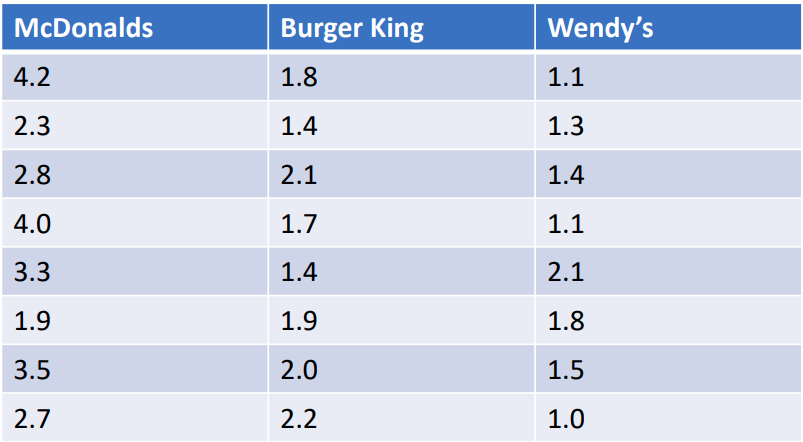

$$
\newcommand{\pr}{\text{I\kern-0.15em P}}
\newcommand{\Ha}{H_a}
\newcommand{\Ho}{H_0}
\newcommand{\pv}{\text{p-value}}
\newcommand{\ss}{\sum_{i=1}^{n}}
$$

# Notes

## Week 4
### Module 2 Week 4C
#### ANOVA

##### One-Way ANOVA

- **An**alysis **o**f **Va**riance

- Recall using a t-test to examine *differences in means between two groups*. 

- We will now extend this to the case of k groups (more than 2 groups). 

- The entire variation in the outcome of interest will be decomposed into separate components. 

- Examples: 

    - Is there a difference in income between lawyers, professors, and doctors? 
    - Is there a difference in revenue between McDonalds, Burger King, and Wendy’s?
    - Is there a difference in GPA between 1st year, 2nd year, junior, and senior students? 

- We will focus on the simple case of *One-Way ANOVA*

    

- *Variances* are used to determine if *means* differ across groups. 

- *Assumptions*: 

    - Each population from which the sample is taken is normal 
    - All samples are random and independent 
    - Populations have equal variances 
    - Each factor is categorical (e.g. profession, restaurant type)
    - Each response (outcome of interest) is numerical (e.g. income, revenue) 

- $\Ho$: all means are equal 

- $\Ha$: at least two means differ

    

- ANOVA uses the ***F-distribution*** 

    - Derived from the *Student’s t-distribution* 

- **F-statistic** is a ratio with numerator $df$ and denominator $df$

- Variance *between* samples 

    - An estimate of overall variance 
    - Variance of the sample means *from the overall mean* 
    - Also known as  *"Variance Due to Treatment"* or *"Explained Variation"*.

- Variance *within* samples 

    - An estimate of overall variance
    - Variance of observations *within* a category *from that category’s mean*
    - Also known ads *"Variation due to Error"* or *"Unexplained Variation"*.

    

- **Sum of squares *total* (SST)** = $\sum_i (X_i - \bar{X})^2 $

- **Sum of squares between (SSB)** $= \sum_k n_k (\bar{X}_k - \bar{X})^2$

    - Often called the *explained* or *model sum of squares* 

- **Sum of squares within (SSW)** $= \sum_k (n_k - 1)(s_k^2)$ 

    - Often called the *sum of squares due to error (SSE)* 

- **SST = SSB + SSW**

- **Mean squared within (MSW)** $= \frac{SSW}{dfw} = \frac{SSW}{n – k}$

    - Often denoted *MSE for mean squared error* 

- **Mean squared between (MSB)** $= \frac{SSB}{dfb} = \frac{SSB}{k – 1}$

- *F-test is all about comparing differences between groups relative to differences within groups.*

    

- *MSB* can be influenced by differences in population means among the different groups. 

- *MSW* is not influenced by differences in population means among the different groups. 

- $\Ho$: *populations all have the same normal distribution* 

    - Remember, we *assume equal variances and normality*, so if means are equal, the normal distributions for each group are the same. 
    - *If $\Ho$ is true, MSB and MSW should be about the same* 

- **F-stat = MSB/MSW** 

    - If $\Ho$ is true, the F-stat ≈ 1
    - Always a *Right-Tailed Test*

    

- E.g. Is there a difference in mean sales between McDonald's, Burger King, and Wendy’s? 

    - Suppose we have the following random sample of data on annual sales
        - 
        -  $\bar{X}= 2.104$, $\bar{X}_{McDon} = 3.09$, $\bar{X}_{BK} = 1.81$, $\bar{X}_{Wendy's}= 1.41$ 
        - $SST = 18.43$ 
        - $SSB = (8*(3.09 – 2.104)^2) + (8*(1.81 – 2.104)^2) + (8*(1.41 – 2.104)^2) = 12.32$
        - $SSW = SST – SSB = 18.43 – 12.32 = 6.11$ 
        - $MSB = 12.32 / (3 – 1) = 6.16$ 
        - $MSW = 6.11 / (24 – 3) = 0.291$
        - $\text{F-stat} = 6.16 / 0.291 = 21.17$
        - Numerator $df = 2$, denominator $df = 21$
        - $\pv = 0.000009$
        - $0.000009 < 0.05$ => reject $\Ho$, there is a difference in mean sales between the three restaurants. 
