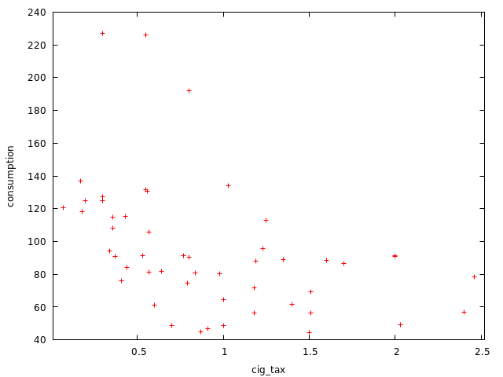
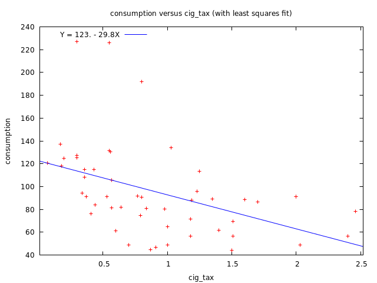

$$
\newcommand{\pr}{\text{I\kern-0.15em P}}
\newcommand{\Ha}{H_a}
\newcommand{\Ho}{H_0}
\newcommand{\pv}{\text{p-value}}
\newcommand{\ss}{\sum_{i=1}^{n}}
$$

# `gretl` Notes
## Week 5
### Module 3 Week 5

#### Simple linear regression using gretl

- Dataset used: `State smoking data.gdt`
  - Open with `File` -> `Open data` -> `User file...`
- Open up a new script editor: `File` -> `Script files` -> `New script` -> 
  `gretl script`

##### Do cigarette taxes (X) reduce smoking (Y)?

- Note the units of measurment:
    - $Y$: consumption, per capita in the state
    - $X$: cigarette taxes (measured in dollars)

###### Exploratory Data Analysis

###### 

1. ```
    gnuplot consumption cig_tax --fit=none --output=display
    ```

    
    

    - Noticable negative relations between cigarette consumption and cigarette tax

2. ```
    ? summary consumption cig_tax
    
                           Mean         Median        Minimum        Maximum
    consumption          95.272         89.090         44.190         226.90
    cig_tax             0.91725        0.80000       0.070000         2.4600
    
                      Std. Dev.           C.V.       Skewness   Ex. kurtosis
    consumption          40.040        0.42027         1.4980         2.8461
    cig_tax             0.59489        0.64855        0.83125     -0.0067839
    
                       5% perc.      95% perc.       IQ range   Missing obs.
    consumption          46.050         205.68         45.690              0
    cig_tax             0.17600         2.1780        0.82000              0
    ```

    - Positive skew for both variables indicated by mean < median.
    - Avg amount of tax per pack of cigarettes is about 92 cents

3. Pearson Correlation Coefficient:

    - ```
        corr consumption cig_tax
        ```

    - ```
        corr(consumption, cig_tax) = -0.44271363
        Under the null hypothesis of no correlation:
         t(49) = -3.45614, with two-tailed p-value 0.0011
        ```

        - Moderate *linear* correlation between the two variables: $-0.44$ (doesn't pick up non-linear relationships)

###### Estimate the regression model

- OUR MODEL: consumption = b0 + b1*cig_tax + error

- We estimate the model using the *method of least squares (OLS)*:

    - Use `const` to include the intercept

    - ```
        ols consumption const cig_tax
        ```

    - ```
        Model 1: OLS, using observations 1-51
        Dependent variable: consumption
        
                     coefficient   std. error   t-ratio   p-value 
          --------------------------------------------------------
          const       122.604       9.39843     13.05     1.47e-17 ***
          cig_tax     −29.7976      8.62165     −3.456    0.0011   ***
        
        Mean dependent var   95.27177   S.D. dependent var   40.04006
        Sum squared resid    64449.25   S.E. of regression   36.26694
        R-squared            0.195995   Adjusted R-squared   0.179587
        F(1, 49)             11.94492   P-value(F)           0.001141
        Log-likelihood      −254.4820   Akaike criterion     512.9639
        Schwarz criterion    516.8276   Hannan-Quinn         514.4403
        ```

    - Interpretation:

        - $\hat{\beta}_0 = 122.604$: but typically not interpreted

        - $\hat{\beta}_1 = -29.8$: For a one-dollar increase in cigarette taxes we expect consumption of cigarettes per capita to decrease by 29.8

        - Hypothesis Test:

            - $\Ho$: $\beta_1 = 0$
                $\Ha$: $\beta_1 \neq 0$

            - $\text{t-stat} = -3.456$

                - Double check manually:

                    - ```
                        scalar tstat = (-29.8 - 0)/8.62165
                        ```

                    - ```
                        Generated scalar tstat = -3.45641
                        ```

                    - => Checks out

            - $\pv = .0011$

            - => Reject $\Ho$, the *coefficient* on the `cig_tax` variable is statistically different from zero (statistically significant)

        - $\text{Sum squared resid} = SSE = 64449.25$

        - $\text{S.E. of regression} = \sqrt{MSE} = 36.26694$

        - $\text{R-squared} = .19$: approximately 19% of the total variation in consumption is explained by its *linear* relationship with `cig_tax`

        - $\text{F-Statistic} = F(1, 49)              = 11.94492$ and $\pv = \text{P-value(F)} = 0.001141$: in case of one predictor, this is the same Hypothesis Test as the `t-ratio` statistic and the `p-value` value reported for the `cig_tax`. Make sure its Square Root equals to the absoluted value of the `t-ratio`:

            - ```
                eval sqrt(11.94492)
                ```

            - ```
                3.4561424
                ```

            - => Checks out

    - OUR ESTIMATED REGRESSION LINE: consumption = 122.6 - 29.8*cig_tax :

        - ```
            gnuplot consumption cig_tax --output=display
            ```

        - 

        - Blue line: estimated regression line

###### Calculate Confidence Intervals

- 95% confidence interval for estimated slope coefficient: 

    - ```
        scalar ub = $coeff(cig_tax) + (critical(t, $df, .025)*$stderr(cig_tax))
        scalar lb = $coeff(cig_tax) - (critical(t, $df, .025)*$stderr(cig_tax))
        ```

    - ```
        ? scalar ub = $coeff(cig_tax) + (critical(t, $df, .025)*$stderr(cig_tax))
        Generated scalar ub = -12.4718
        ? scalar lb = $coeff(cig_tax) - (critical(t, $df, .025)*$stderr(cig_tax))
        Generated scalar lb = -47.1235
        ```

    - => confidence interval $= (-47.12, -12.47) $: $0$ is outside of the CI => consistent with rejecting the $\Ho$

###### Prediction

- let's predict consumption for cig tax of \$1

    - ```
        scalar predict_1dollartax = $coeff(const) + ($coeff(cig_tax)*1)
        ```

    - ```
        Generated scalar predict_1dollartax = 92.8062
        ```

    - => We predicted that annual cigarette consumption per capita is equal to $92.8$ when cigarette tax equals \$1

- let's predict consumption for cig tax of $2

    - ```
        scalar predict_1dollartax = $coeff(const) + ($coeff(cig_tax)*2)
        ```

    - ```
        Replaced scalar predict_1dollartax = 63.0085
        ```

    - => We predicted that annual cigarette consumption per capita is equal to $63.0085$ when cigarette tax equals \$2

###### GUI way for OLS:

- `Model` - > `Ordinary Least Squares` -> move `cig_tax` to the right (`const` should already be included by default)
- For CI's: `Analysis` -> `Confidence Intervals for coefficients`
- Note again: CI's are for the coefficients, not for the variables


