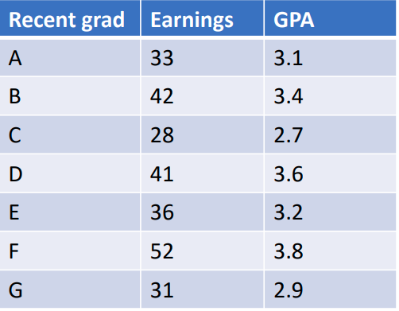
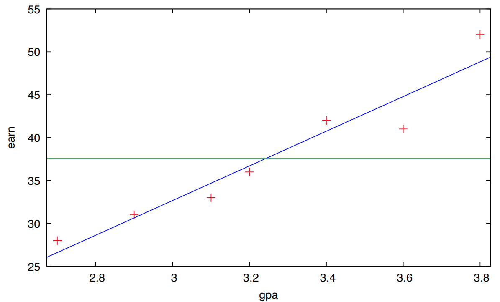

$$
\newcommand{\pr}{\text{I\kern-0.15em P}}
\newcommand{\Ha}{H_a}
\newcommand{\Ho}{H_0}
\newcommand{\pv}{\text{p-value}}
\newcommand{\ss}{\sum_{i=1}^{n}}
$$

# Notes

## Week 5
### Module 3 Week 5A

#### Simple Linear Regression 
- Regression analysis is one of the most powerful and widely used statistical tools across the sciences. 

- Measure relationships *between* variables

    - To put it overly simply: "How are $x$ and $y$ related?"

- We have a variable (outcome) of interest 

- We have data

- Our primary task is to develop a mathematical model (an equation) describing where the outcome comes from (i.e. how the values are generated). 

- We will fit the model to the data

  ​    

- Suppose we are interested in the annual earnings of recent college graduates (this is our outcome of interest). 

- One approach to analyzing the outcome of interest would be to gather a (random) sample of data on earnings of recent graduates and calculate the average (mean). 

- Predictions about recent graduate earnings could then be made using the sample average.

    - This is equivalent to using average earnings as a *model* for the true earnings of recent graduates.

    

- Outcome of interest ( $y$ ) 

    - *Response variable* or *dependent variable* 
    - The variable to be modeled 

- Population mean ( $\mathbb{E}(y)$ , the *first moment* of a distribution) 

    - Expected value 

- E.g. $y =$ earnings of recent graduates, $\mathbb{E}(y)$ = mean earnings for all recent graduates (an observable population, mean of the outcome of interest)

    - Earnings will depend on many factors (e.g. GPA, major, etc.) 
        - There is a *distribution* of earnings 
        - Therefore, we are modeling actual earnings as being equal to mean earnings plus *random error*

            - $y = \mathbb{E}(y) + \epsilon$ 
                - This is a *probabilistic model* : when certain assumptions about the model are satsified, we can make probabilistic statments about the devation between $y$ and mean of $y$.
                - We need to estimate the parameters of the model (here $\mathbb{E}(y)$ and $\epsilon$ ) 
                - Standard assumption is that the mean of  $\epsilon = 0$
                - Our best estimate for $\epsilon$ is $0$, therefore, we only need to estimate $\mathbb{E}(y)$

    

- The simplest method for estimating $\mathbb{E}(y)$ is to use the sample average $\bar{y}$. 

    - A “hat” is used to denote estimated or predicted values 
    - $\hat{y} = \bar{y}$
        - Predict earnings using average earnings 

- This simple model does not account for the important *independent* variables that also influence earnings. 

    - A more accurate model can be developed by including these variables. 
    - It is less confusing to call these variables *predictor* variables, and they are denoted with $x$, because "independent" here is does not imply "independent" in a probabilistic sense

    

- Suppose we decide to relate earnings to GPA. 

    - Collect a random sample
    - Observe earnings and GPA 
        - 
    - Plot the relationship
        - Scatterplot 
    - Describe relationship with an equation 
    - Fit the data with a line (or curve)
        - 
        - There is some error between the prediction (blue line) and the data points. But this error is much better than if we had simply used the sample mean of earnings ($\bar{y}$, the green line) => including an important predictor reduced our prediction's error.

    

- **Regression Analysis:** one of the statistical techniques relating a response variable to a set of predictors 

    - The goal is to build a good model 
    - A model that allows us to predict $y$ for a given $x$ with a small amount of error. 

- A good model usually has more than one predictor. 

- Suppose we are interested in relating a restaurant’s sales as a function of money spent on advertising and number of cars that pass by per day. 

- This could be represented with a *response surface* that traces mean sales as a function of advertising spending ( $x_1$ ) and the number of cars that pass by ( $x_2$ ). 

    - Find a certain ( $x_1, x_2$ ) point and the height of the surface gives $\mathbb{E}(y)$

- A mathematical equivalent of the response surface might be given by the following *deterministic* model 

    - $\mathbb{E}(y) = \beta_0 + \beta_1 x_1 + \beta_2 x_2$
    - *Deterministic*: because if the $\beta$'s are known, $x_1$ and $x_2$ values exactly determine the mean of $y$, i.e. $\mathbb{E}(y)$
    - $\beta$: constants (weights) that must be estimated using our sample of data

- Replacing $\mathbb{E}(y)$ in our probabilistic model: $y = \beta_0 + \beta_1 x_1 + \beta_2 x_2 + \epsilon$

    - This is our regression model 

    

- Regression model: $y = \beta_0 + \beta_1 x_1 + \beta_2 x_2 + \epsilon$

- Collecting data on $y$, $x_1$ and $x_2$ ( and subjecting the equation to regression analysis will yield *estimates* for the $\beta$ terms and allow for *predictions* of $y$. 

    - $\hat{y} = \hat{\beta}_0 + \hat{\beta}_1 x_1 + \hat{\beta}_2 x_2$

- The predictors will usually be composed of both quantitative and qualitative variables. 

- Regression analysis is used to *estimate* the mean value of $y$ (i.e. $\mathbb{E}(y)$ ) for given $x$ values, to *predict* values of $y$, and to decipher the relationship between the outcome and the predictors. 

- Observational versus experimental data:

    - **Observational**: No attempt made to control individual values of the $x$'s; they're not determined prior to observing $y$; usually because we can't due to practical and/or ethical considerations => most studies use *Observational* data
        - Challange: establising *Causation* is difficult with observational data
    - **Experimental**: Value of $x$'s are controlled through a designed experiment

- *Size of the sample regression analysis*:

    - Number of observations $\geq$ Number of $\beta$'s; otherwise, can't estimate $\beta$'s
    - Rule of thumb: $n \geq 10 * \text{Number of } \beta \text{'s}$

