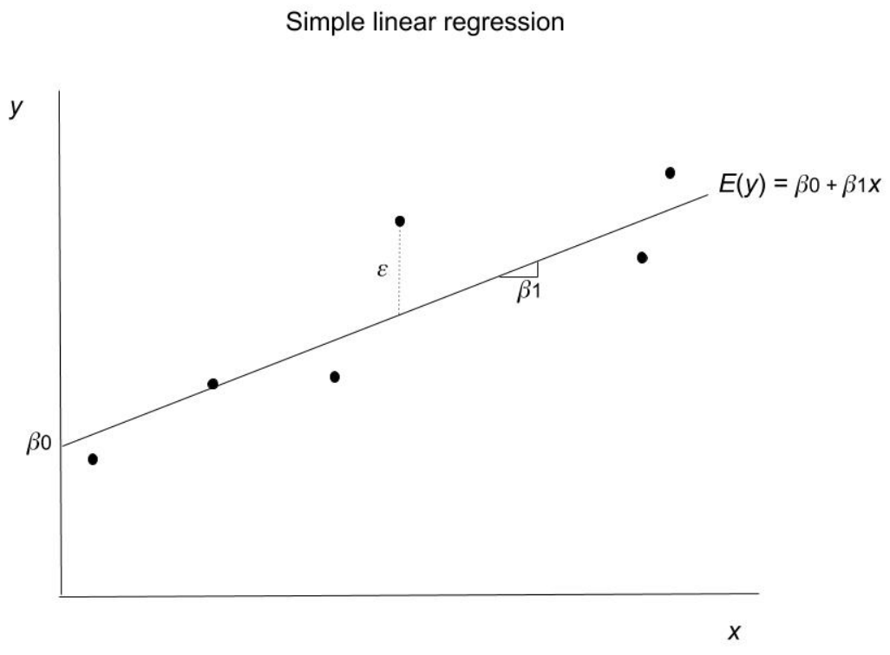
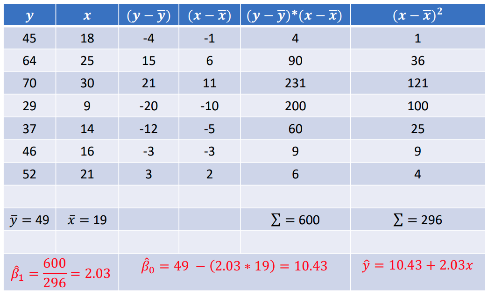

$$
\newcommand{\pr}{\text{I\kern-0.15em P}}
\newcommand{\Ha}{H_a}
\newcommand{\Ho}{H_0}
\newcommand{\pv}{\text{p-value}}
\newcommand{\ss}{\sum_{i=1}^{n}}
$$

# Notes

## Week 5
### Module 3 Week 5B
#### Simple Linear Regression

- **Simple Linear Regresion**: a straight-line probabilistic model relating a single response variable ( $y$ ) to a single predictor ( $x$ ). 

    - Usually fit to the data using the method of *Least Squares*

- E.g. How does advertising spending ( $x$ ) relate to sales ( $y$ )? 

    - It is unlikely that advertising spending *exactly* determines sales, even with more than one predictor. 
    - There will be variation in sales due to unobservable underlying random phenomena. 
    - Therefore, we will specify a probabilistic model 
        - $y = \beta_0 + \beta_1 x_1 + \epsilon$
            - First-order (straight-line) model
            - The *Error Term*, $\epsilon$ - represents all unexplained variation in sales due to important omitted factors and unexplained random phenomena
                - Important role for conducting *Hypothesis Tests* and *Confidence Intervals* for the deterministic portion of the model

    

- #### $y = \beta_0 + \beta_1 x_1 + \epsilon$

    - $y$ is the response variable 

    - $x$ is the predictor variable 

    - **First-Order**: because $x$ is not squared/cubed or some other non-linear function; i.e. the predictor has an exponent of $1$

    - $\mathbb{E}(y) = \beta_0 + \beta_1 x_1$ is the deterministic part of the model 
        - Represents the line of means

    - $\epsilon$ is the *random error term* 

    - $\beta_0$ is the $y$-*intercept*

    - $\beta_1$ is the *slope* which measures how much $y$ changes from a one-unit increase in $x$.

    - $\beta$'s are *population parameters*; only known if we have data on the entire population

    - Standard assumption: $\mathbb{E}(\epsilon) = 0$

    

    

- The *method of least squares* is the most common technique used to fit the model to the data. 

- How can we best use our sample to estimate the parameters of interest (i.e. estimate the $\beta$'s)? 

- One way to quantitatively determine how well the line fits the data is to measure how much each data point *deviates* from the line. 

    - Errors of prediction: the vertical distance between a data point and the line 
        - The sum of the errors of prediction equal $0$, however, their squared sum does not. 

- There are many lines that make the sum of errors equal $0$, but there is only one where the *sum of errors squared* is at a *minimum*. 

    - The *least squares line* or the *least squares prediction equation*

    

- The deviation of the $i$'th observation from the line is known as the $i$'th residual. 

- $i$'th residual $= \text{i'th Observed Value} - \text{i'th Predicted Value} = y_i − \hat{y}_i = y_i − (\hat{\beta}_0 + \hat{\beta}_1 x_i)$

- The estimates for the $\beta$'s that makes the *sum of residuals squared (SSE)* as small as possible are the *least squares estimates*: 

    - $\hat{\beta}_1 = \frac{\sum_i (x_i - \bar{x}) (y_i -\bar{y})}{\sum_i (x_i - \bar{x})^2}$

    - $\hat{\beta}_{0} = \bar{y} - \hat{\beta}_1 \bar{x}$

      

- Suppose we have the following sample of data:

    

    - Tedious => use computational software to do this

    

- $\hat{y} = 10.43 + 2.03 x$

- *Interpretation is important*:

    - When $x$ increases by one-unit, $y$ increases by $2.03$
    - We almost always want the $y$-intercept in the model, but typically, little attention is paid to its numerical value and interpretation. 
        - Interpretation is only sensible when $x = 0$ is within the range of values for $x$ observed in the sample of data.
    - For a given value of $x$ we predict the value of $\hat{y}$
