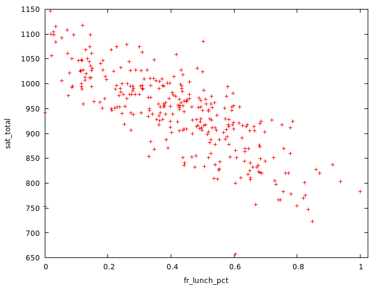

$$
\newcommand{\pr}{\text{I\kern-0.15em P}}
\newcommand{\Ha}{H_a}
\newcommand{\Ho}{H_0}
\newcommand{\pv}{\text{p-value}}
\newcommand{\ss}{\sum_{i=1}^{n}}
$$

# `gretl` Notes
## Week 6
### Module 3 Week 6

#### Multiple linear regression using gretl

- Dataset used: `Georgia public high schools 2010.gdt`
  - Open with `File` -> `Open data` -> `User file...`
- Open up a new script editor: `File` -> `Script files` -> `New script` -> 
  `gretl script`

##### EDA

- ```
    ? freq school_type_1
    
    Frequency distribution for school_type_1, obs 1-367
    
              frequency    rel.     cum.
    
       1          12      3.27%    3.27% *
       2          29      7.90%   11.17% **
       3           6      1.63%   12.81% 
       4         320     87.19%  100.00% *******************************
    ```

    - Most schools are regular; restric analysis to those only; but may or may not be a good idea in real scenario

- ```
    ? smpl school_type_1=4 --restrict
    Full data set: 367 observations
    Current sample: 320 observations
    ```

- If wanted to unrestric, we would do:

    - ```
        smpl --full
        ```

##### Prelimenaries

- Our outcome of interest (Y) is average SAT school 

- How does the percentage of students who are low income (X1) relate to average SAT scores?

    - Even with Multiple Linear Regression, we are often interested in a single variable / main question
    - Including other predicts will allow for more accurate estimate for the question of interest

- ```
    ? gnuplot sat_total fr_lunch_pct --output=display --fit=none
    Warning: "school_type_1=4"
     obsolete use of "=" as Boolean test: please use "=="
    ```

    - 
    - => The more students on low income, lower SAT scores tend to be

##### Simple Linear Regression

- ```
    ? ols sat_total const fr_lunch_pct
    
    Model 1: OLS, using observations 1-320 (n = 315)
    Missing or incomplete observations dropped: 5
    Dependent variable: sat_total
    
                     coefficient   std. error   t-ratio    p-value 
      -------------------------------------------------------------
      const           1067.47        6.75561    158.0     1.49e-300 ***
      fr_lunch_pct    −298.181      14.3371     −20.80    6.04e-61  ***
    
    Mean dependent var   941.4349   S.D. dependent var   81.65102
    Sum squared resid    878861.4   S.E. of regression   52.98928
    R-squared            0.580176   Adjusted R-squared   0.578835
    F(1, 313)            432.5501   P-value(F)           6.04e-61
    Log-likelihood      −1696.541   Akaike criterion     3397.081
    Schwarz criterion    3404.587   Hannan-Quinn         3400.080
    ```

- Only 315 observations out of 320 used because of missing observations

- $SSE = 878861.4$ - the term that the OLS minimizes

- We're linearly explaining just under 60\% of variation in average SAT scores using the free lunch percent variable

- Since only one predictor, F-Test is the same information as the T-Test

- T-Stat is statistically significant

- For a one unit increase in the free lunch variable, there is almost a 300 point decrease in SAT scores - suprisingly big impact => investigate further:

    - ```
        ? summary fr_lunch_pct --simple
        
        Summary statistics, using the observations 1 - 320
        for the variable 'fr_lunch_pct' (319 valid observations)
        
          Mean                       0.42028
          Minimum                     0.0000
          Maximum                     1.0000
          Standard deviation         0.21044
          Missing obs.                     1
        ```

    - free lunch percent variable is not a percent but a proportion! => one unit increase corresponds to 100\% percent increase!

    - => New variable in percentage points:

    - ```
        series fr_lunch_pct = fr_lunch_pct * 100
        ```

    - Re-run OLS:

    - ```
        ? ols sat_total const fr_lunch_pct
        
        Model 3: OLS, using observations 1-320 (n = 315)
        Missing or incomplete observations dropped: 5
        Dependent variable: sat_total
        
                         coefficient   std. error   t-ratio    p-value 
          -------------------------------------------------------------
          const          1067.47          6.75561     158.0     1.49e-300      
          fr_lunch_pct     −2.98181     0.143371    −20.80    6.04e-61  ***
        
        Mean dependent var   941.4349   S.D. dependent var   81.65102
        Sum squared resid    878861.4   S.E. of regression   52.98928
        R-squared            0.580176   Adjusted R-squared   0.578835
        F(1, 313)            432.5501   P-value(F)           6.04e-61
        Log-likelihood      −1696.541   Akaike criterion     3397.081
        Schwarz criterion    3404.587   Hannan-Quinn         3400.080
        ```

    - Same info, but better interpretation: For a one-percentage point increase in percent of students who are low income, average SAT scores decreases by 2.98 points. 

    - *Simple rule of thumb: measure percentage variables with whole numbers (i.e. between 0 and 100, rather than 0 and 1)*

##### Multiple Linear Regression

- Let's include some more X variables, this will allow us to obtain more precise estimates and predictions; informed by theory and logic, not just any variables; when unsure, include the variable to analyze results

- First, check one of the percent variables:

- ```
    ? summary tchmas_pnt --simple
    
    Summary statistics, using the observations 1 - 320
    for the variable 'tchmas_pnt' (319 valid observations)
    
      Mean                        57.130
      Minimum                     33.333
      Maximum                     77.419
      Standard deviation          8.5296
      Missing obs.                     1
    ```

    - Seems fine; expressed as actual percentage points

- ```
    ? ols sat_total const fr_lunch_pct stratio tch_avg_salary tch_avg_year_exp \
      tchmas_pnt admin_avg_year_exp
    
    Model 4: OLS, using observations 1-320 (n = 315)
    Missing or incomplete observations dropped: 5
    Dependent variable: sat_total
    
                          coefficient  std. error  t-ratio   p-value 
      ---------------------------------------------------------------
      const               948.524      66.9759      14.16    2.07e-35 ***
      fr_lunch_pct         −2.93377     0.155934   −18.81    4.16e-53 ***
      stratio              −1.45335     1.57564     −0.9224  0.3570  
      tch_avg_salary        0.928232    1.38939      0.6681  0.5046  
      tch_avg_year_exp     −0.315026    1.61864     −0.1946  0.8458  
      tchmas_pnt            1.05519     0.431189     2.447   0.0150   **
      admin_avg_year_e~     1.93080     0.796595     2.424   0.0159   **
    
    Mean dependent var   941.4349   S.D. dependent var   81.65102
    Sum squared resid    808335.8   S.E. of regression   51.22955
    R-squared            0.613865   Adjusted R-squared   0.606343
    F(6, 308)            81.60816   P-value(F)           1.05e-60
    Log-likelihood      −1683.366   Akaike criterion     3380.732
    Schwarz criterion    3407.000   Hannan-Quinn         3391.227
    
    Excluding the constant, p-value was highest for variable 19 (tch_avg_year_exp) 
    ```

    - Mean and SD Dependent variable - unchanged
    - Smaller Sum of Squared Residuals and SE of regression: as expected because added more variables
    - $R^2$ and $R^2_A$- increased slightly: especially because of Adjusted R Squared increase => additional predictors provide us with additional explanatory power (regular $R^2$ always goes up when adding additional predictors)
        - Note adjusted R-squared increased, suggesting at least one of the additional X variables we included has explanatory power (i.e. explains variation in Y)
    - F statistic and associated P-Value: only for slope coefficients being jointly equal to 0 (constant is not included in the F-Test); low pvalue => We reject the joint hypothesis test that all of the slope coefficients are equal to zero (F-test) --> model is statistically useful 
    - Coefficient interpretation:
        - Note free lunch pct variable coefficient hasn't changed much => good news; suggests we were already doing a decent job describing the relationship of main interest (which remains statistically significant)
        - For a one percentage point increase in the percent of students who are low income, the average sat score decreases by 2.93 points, *holding all other Xs constant* (in the model)
        - For a one unit increase in the student teacher ratio, the average sat score *decreases* by 1.45 points (this effect is *not* statistically different from zero), *holding all other Xs constant*
        - For a one thousand dollar increase in teacher average salary, the average sat score increases by .93 points (this effect is *not* statistically different from zero), *holding all other Xs constant*
        - For a one year increase in average years of experience for teachers, the average sat score decreases by .32 points (this effect is *not* statistically different from zero), *holding all other Xs constant*
        - For a one percentage point increase in the percent of teachers with advanced degrees, the average sat score increases by 1.06 points (this effect is *statistically significant*), *holding all other Xs constant*
        - For a one year increase in average years of experience for the administration, the average sat score increases by 1.93 points (this effect is *statistically significant*), *holding all other Xs constant*

##### Test Restrictions

- Idea: After estimating the model, we can test restrictions; instead of testing all of the coefficients being equal to 0 (which is the default OLS test), test only a subset of them being jointly equal to 0

- Test that all but the free lunch pct variables have coefficients equal to 0 (start with `b[3]` because `b[1]` is the constant term):

- ```
    ? restrict
    ? b[3]=0
    ? b[4]=0
    ? b[5]=0
    ? b[6]=0
    ? b[7]=0
    ? end restrict
    Restriction set
     1: b[stratio] = 0
     2: b[tch_avg_salary] = 0
     3: b[tch_avg_year_exp] = 0
     4: b[tchmas_pnt] = 0
     5: b[admin_avg_year_exp] = 0
    
    Test statistic: F(5, 308) = 5.37447, with p-value = 9.37926e-05
    
    Restricted estimates:
    
                          coefficient  std. error  t-ratio   p-value  
      ----------------------------------------------------------------
      const               1067.47       6.75561    158.0     1.49e-300 ***
      fr_lunch_pct          −2.98181    0.143371   −20.80    6.04e-61  ***
      stratio                0.00000    0.00000     NA      NA        
      tch_avg_salary         0.00000    0.00000     NA      NA        
      tch_avg_year_exp       0.00000    0.00000     NA      NA        
      tchmas_pnt             0.00000    0.00000     NA      NA        
      admin_avg_year_exp     0.00000    0.00000     NA      NA        
    
      Standard error of the regression = 52.9893
    ```

    - => `F(5, 308) = 5.37447` and associated `p-value = 9.37926e-05` => We reject $\Ho$ that the coefficients on the additional Xs we included are equal to zero
        - Allows to do restrictions jointly, instead of individual t-tests (which we should avoid).

- Let's test if the coefficients on the teacher variables are equal to zero:

- ```
    ? restrict
    ? b[4]=0
    ? b[5]=0
    ? b[6]=0
    ? end restrict
    Restriction set
     1: b[tch_avg_salary] = 0
     2: b[tch_avg_year_exp] = 0
     3: b[tchmas_pnt] = 0
    
    Test statistic: F(3, 308) = 3.86588, with p-value = 0.00973483
    
    Restricted estimates:
    
                          coefficient  std. error  t-ratio   p-value  
      ----------------------------------------------------------------
      const               1053.86      32.6073      32.32    1.96e-101 ***
      fr_lunch_pct          −3.08672    0.144387   −21.38    5.19e-63  ***
      stratio               −2.05846    1.55663     −1.322   0.1870   
      tch_avg_salary         0.00000    0.00000     NA      NA        
      tch_avg_year_exp       0.00000    0.00000     NA      NA        
      tchmas_pnt             0.00000    0.00000     NA      NA        
      admin_avg_year_exp     2.46546    0.731017     3.373   0.0008    ***
    
      Standard error of the regression = 51.9328
    ```

    - => `p-value = 0.00973483` => We reject $\Ho$ that the coefficients on the teacher variables are jointly equal to zero

##### Using the GUI

- `Model` -> `Ordinary Least Squares` -> `sat_total` for `Dependent variable`; and others as `Regressors` -> `Ok`
- Can do `Analysis` -> `Confidence intervals for coefficients` or look at the significance at the output directly.

