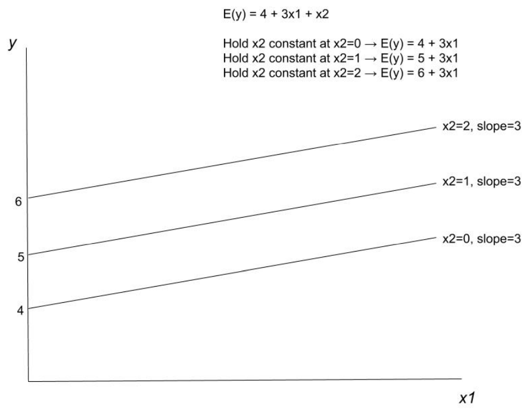

$$
\newcommand{\pr}{\text{I\kern-0.15em P}}
\newcommand{\Ha}{H_a}
\newcommand{\Ho}{H_0}
\newcommand{\pv}{\text{p-value}}
\newcommand{\ss}{\sum_{i=1}^{n}}
$$

# Notes

## Week 6
### Module 3 Week 6A

#### Multiple Linear Regression 

- **Multiple Linear Regression**: more than 1 predictor variable, 1 outcome variable
- **Multivariate Model**: when more than 1 *outcome* variable; NOT Multiple Linear Regression

- A regression model with more than one $x$ variable is called a *multiple regression model*. 

- Including additional predictors can help achieve more accurate predictions. 

    - But beware of the "kitchen sink" approach; stuffing additional predictors  can lead to overfit and ppor generalization for the population of interest

- General form of probabilistic model: 

    - $y = \beta_0 + \beta_1 x_1 + \beta_2 x_2 + ... + \beta_k x_k + \epsilon$

- The deterministic component of the model is: 

    - $\mathbb{E}(y) = \beta_0 + \beta_1 x_1 + \beta_2 x_2 + ... + \beta_k x_k$

- The coefficients ( $\beta$'s ) measure the change in $y$ from a one-unit increase in that $x$ variable, holding all other $x$ variables constant.

    

- The predictors can be higher-order terms (e.g. $x_2 = x_1^2$ ) 

- The predictors can be qualitative variables 

    - These are still *linear* regression models - it is about how $\beta$'s enter the model, not the $x$'s 

- On the previous slide we saw that $y$ has two components, a deterministic component ( $\beta_0 + \beta_1 x_1 + \beta_2 x_2 + ... + \beta_k x_k$ ) and a random error term ( $\epsilon$ ). $y$ is therefore a random variable whose variation is determined by $\epsilon$.

    

- Assumptions: 

    - For any given set of values for $x_1, x_2, ..., x_k$
        - $\epsilon \sim N(0, \sigma^2)$
        - The $\epsilon$ for any two observations are *independent* 

- Given these assumption we have: 

    - $\mathbb{E}(y) = \beta_0 + \beta_1 x_1 + \beta_2 x_2 + ... + \beta_k x_k$
    - The model is called "Linear" because the Mean of $y$ is a *linear* function of the $\beta$'s, not necessarily the $x$'s

- In practice, we never know for certain whether the assumptions hold. 

- In practice, the assumptions don’t have to hold exactly to be able to produce a useful regression model. 

- These models are *linear* because the $\beta$ terms enter the equation for $\mathbb{E}(y)$ in a linear fashion. 

    

- First-order model with quantitative predictors: 

    - Each $x$ is raised to the first power 

- Example with two $x$ variables: 

    - $y = \beta_0 + \beta_1 x_1 + \beta_2 x_2 + \epsilon$
    - $\beta_1$ represents the slope of the line relating $x_1$ to $y$ holding $x_2$ constant 
    - $\beta_2$ represents the slope of the line relating $x_2$ to $y$ holding $x_1$ constant 
    - The effect of $x_1$ on $y$ is independent of $x_2$
    - The effect of $x_2$ on $y$ is independent of $x_1$

    

- 

    - Note: once $x_2$ is held constant, the slope $\hat{\beta_1}$ is ocnstant, showing the effect of $x_1$ is independent of other predictors in the model

    

- The *method of least squares* is still used to fit the model to the data. 

    - The estimates for the $\beta$'s that minimizes the sum of residuals squared 
        - Minimizes SSE 
        - No simple formulas => use matrix algebra + computation

- E.g. Model: $y = \beta_0 + \beta_1 x_1 + \beta_2 x_2 + \epsilon$

    - Using a sample of data and the method of least squares the model’s parameters are estimated: 
        - $\hat{y} = 2.1 + 3.12 x_1 - 1.78 x_2$
        - When $x_1$ increases by one-unit, $y$ increases by $3.12$, holding $x_2$ fixed. 
        - When $x_2$ increases by one-unit, $y$ decreases by $1.78$, holding $x_1$ fixed. 

- Predict $y$ for any $x$ values (within the sample range) by simply plugging those $x$ values into the estimated equation.

