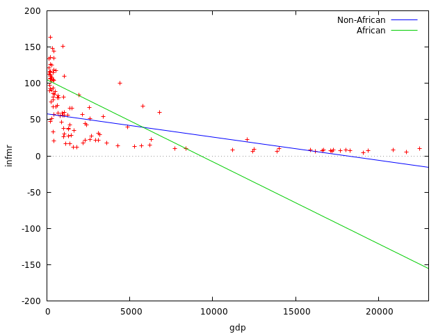
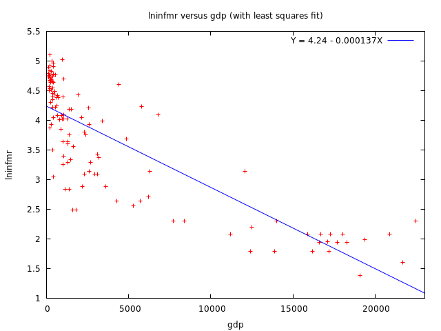

$$
\newcommand{\pr}{\text{I\kern-0.15em P}}
\newcommand{\Ha}{H_a}
\newcommand{\Ho}{H_0}
\newcommand{\pv}{\text{p-value}}
\newcommand{\ss}{\sum_{i=1}^{n}}
$$

# `gretl` Notes
## Week 7
### Module 4 Week 7

#### Additional Regression Models using gretl

- Dataset used: `Country data.gdt`
  - Open with `File` -> `Open data` -> `User file...`
- Open up a new script editor: `File` -> `Script files` -> `New script` -> 
  `gretl script`
- We are interested in the relationship between infant mortality (Y) and GDP (X)

##### EDA

- Note units of measurement, which is important for interpreting estimates: GDP is in GDP per capita and infant mortality is in per 1000 live births
- Scatterplot of relationship:
    - `gnuplot infmr gdp --fit=none --output=display`
    - 
    - Observe: a negative relationship, but is not exactly linear

##### First-Order Simple Linear Regression

- Let's save the results from this model, and call them `m1`:

- ```
    ? m1 <- ols infmr const gdp
    
    m1: OLS, using observations 1-122
    Dependent variable: infmr
    
                 coefficient   std. error    t-ratio   p-value 
      ---------------------------------------------------------
      const      77.1704       3.67060       21.02     4.78e-42 ***
      gdp        −0.00449371   0.000497865   −9.026    3.56e-15 ***
    
    Mean dependent var   58.48689   S.D. dependent var   43.20290
    Sum squared resid    134519.9   S.E. of regression   33.48133
    R-squared            0.404372   Adjusted R-squared   0.399408
    F(1, 120)            81.46794   P-value(F)           3.56e-15
    Log-likelihood      −600.4427   Akaike criterion     1204.885
    Schwarz criterion    1210.493   Hannan-Quinn         1207.163
    
    m1 saved
    ```

- Interpretation:

    - For a one dollar increase in gdp per capita, infant mortality per 1000 births decreases by .0045. This result is statistically significant.
    - We explain about 40% of the infant mortality with this linear model.

- Graph the fit from this previous model:

    - ```
        ? gnuplot infmr gdp --output=display
        ```

    - 

        - The slope is negative, as expected. 
        - But constant slope is problematic; getting predicted infant mortality rates that are negative at high GDP per capital values; non-sensical, because can never occur in the underlying population of interest => linear model is not great

##### Linear Regression with a Dummy Variable

- Recall that countries in Africa are in regions 1 through 5:

    - `Data` -> `Sort data...` -> `Select sort key` by `region` -> `OK`

    - ```
        ? print country region --byobs
        
                         country               region
        
          1              Burundi                    1
          2             Ethiopia                    1
          3                Kenya                    1
          4           Madagascar                    1
          5               Malawi                    1
          6            Mauritius                    1
          7           Mozambique                    1
          8               Rwanda                    1
          9              Somalia                    1
         10             Tanzania                    1
         11               Uganda                    1
         12               Zambia                    1
         13             Zimbabwe                    1
         14               Angola                    2
         15             Cameroon                    2
         16 Central African Rep.                    2
         17                 Chad                    2
         18                Congo                    2
         19                Gabon                    2
         20                Zaire                    2
         21              Algeria                    3
         22                Egypt                    3
         23                Libya                    3
         24              Morocco                    3
         25                Sudan                    3
         26              Tunisia                    3
         27             Botswana                    4
         28              Lesotho                    4
         29              Namibia                    4
         30         South Africa                    4
         31                Benin                    5
         32         Burkina Faso                    5
         33                Ghana                    5
         34               Guinea                    5
         35              Liberia                    5
         36                 Mali                    5
         37           Mauritania                    5
         38                Niger                    5
         39              Nigeria                    5
         40              Senegal                    5
         41         Sierra Leone                    5
         42                 Togo                    5
         43                 Cuba                    6
         44   Dominican Republic                    6
         45                Haiti                    6
         46              Jamaica                    6
         47    Trinidad & Tobago                    6
         48           Costa Rica                    7
         49          El Salvador                    7
         50            Guatemala                    7
         51             Honduras                    7
         52               Mexico                    7
         53            Nicaragua                    7
         54               Panama                    7
         55            Argentina                    8
         56              Bolivia                    8
         57               Brazil                    8
         58                Chile                    8
         59             Colombia                    8
         60              Equador                    8
         61               Guyana                    8
         62             Paraguay                    8
         63                 Peru                    8
         64              Uruguay                    8
         65            Venezuela                    8
         66               Canada                    9
         67        United States                    9
         68                China                   10
         69                Japan                   10
         70             Mongolia                   10
         71          North Korea                   10
         72          South Korea                   10
         73             Cambodia                   11
         74            Indonesia                   11
         75                 Laos                   11
         76             Malaysia                   11
         77              Myanmar                   11
         78            Singapore                   11
         79             Thailand                   11
         80              Vietnam                   11
         81          Afghanistan                   12
         82           Bangladesh                   12
         83               Bhutan                   12
         84                India                   12
         85                 Iran                   12
         86                Nepal                   12
         87             Pakistan                   12
         88            Sri Lanka                   12
         89                 Iraq                   13
         90               Israel                   13
         91               Jordan                   13
         92               Kuwait                   13
         93              Lebanon                   13
         94                 Oman                   13
         95         Saudi Arabia                   13
         96                Syria                   13
         97               Turkey                   13
         98  United Arab Emirate                   13
         99                Yemen                   13
        100             Bulgaria                   14
        101              Hungary                   14
        102               Poland                   14
        103              Romania                   14
        104              Denmark                   15
        105              Finland                   15
        106              Ireland                   15
        107               Norway                   15
        108               Sweden                   15
        109       United Kingdom                   15
        110              Albania                   16
        111               Greece                   16
        112                Italy                   16
        113             Portugal                   16
        114                Spain                   16
        115              Austria                   17
        116              Belgium                   17
        117               France                   17
        118          Netherlands                   17
        119          Switzerland                   17
        120            Australia                   18
        121          New Zealand                   18
        122     Papua New Guinea                   18
        ```

- Create the dummy variable for Africa:

    - ```
        ? series africa = region>=1 && region<=5
        Generated series africa (ID 17)
        ```

- Regression:

    - ```
        ? m2 <- ols infmr const gdp africa
        
        m2: OLS, using observations 1-122
        Dependent variable: infmr
        
                     coefficient   std. error    t-ratio   p-value 
          ---------------------------------------------------------
          const      58.8601       4.22915       13.92     1.00e-26 ***
          gdp        −0.00331314   0.000465683   −7.115    9.11e-11 ***
          africa     38.9294       5.96748        6.524    1.75e-09 ***
        
        Mean dependent var   58.48689   S.D. dependent var   43.20290
        Sum squared resid    99084.85   S.E. of regression   28.85560
        R-squared            0.561271   Adjusted R-squared   0.553898
        F(2, 119)            76.11912   P-value(F)           5.14e-22
        Log-likelihood      −581.7929   Akaike criterion     1169.586
        Schwarz criterion    1177.998   Hannan-Quinn         1173.002
        
        m2 saved
        
        ```

    - Interpretation:

        - For a one dollar increase in gdp per capita, infant mortality per 1000 births decreases by .0033

        - That mean infant mortality rate is 38.93 higher in African countries relative to non-African

            - Coefficient on the Dummy Variable: difference in the mean outcome for when the Variable is 1 vs 0. 

        - Estimates interpretation:

            - infmr_hat = 58.86 - .0033 * gdp + 38.93 * africa

            - There are two regression lines with the same $- 0.0033$ slope, but the intercept is different depending on if we're in or not in Africa:

                - Non-African countries --> infmr_hat = 58.86 - .0033 * gdp + 38.93 * 0 = 58.86 - .0033 * gdp

                - African countries --> infmr_hat = 58.86 - .0033 * gdp + 38.93 * 1 = (58.86 + 38.93) - .0033 * gdp

                - The $38.93$ coefficient on `africa` is shifting the intercept up by $38.93$ from $58.86$

                - ```
                    ? gnuplot infmr gdp --output=display --fit=none
                    ```

                - Add lines by hand: 

                    - `Menu` -> `Edit` -> `Lines` -> `Add Line` -> add `58.86 - .0033 * x` to `formula` -> `Ok`; `legend`: `Non-African Countries`
                    - `Menu` -> `Edit` -> `Lines` -> `Add Line` -> add `(58.86 + 38.93) - .0033 * x` to `formula` -> `Ok`; `legend`: `African Countries`
                    - `Main` -> `key position`: `right top`
                    - 

##### Regression with Interaction Terms

- Perhaps the effect of GDP depends on whether or not we are in an African country => Interaction term (Addresses the question: Does the effect on one predictor depend on the value of some other predictor)

- ```
    ? series africagdp = africa*gdp
    Generated series africagdp (ID 18)
    ```

- ```
    ? m3 <- ols infmr const gdp africa africagdp
    
    m3: OLS, using observations 1-122
    Dependent variable: infmr
    
                  coefficient   std. error    t-ratio   p-value 
      ----------------------------------------------------------
      const       58.0376       4.16953       13.92     1.18e-26 ***
      gdp         −0.00317309   0.000461445   −6.876    3.12e-10 ***
      africa      46.8542       6.79330        6.897    2.81e-10 ***
      africagdp   −0.00810031   0.00350933    −2.308    0.0227   **
    
    Mean dependent var   58.48689   S.D. dependent var   43.20290
    Sum squared resid    94804.29   S.E. of regression   28.34477
    R-squared            0.580225   Adjusted R-squared   0.569553
    F(3, 118)            54.36761   P-value(F)           3.83e-22
    Log-likelihood      −579.0990   Akaike criterion     1166.198
    Schwarz criterion    1177.414   Hannan-Quinn         1170.754
    
    m3 saved
    
    ```

- Interpretation: 

    - `58.0376` for `const` - intercept for non-African Countries

    - `−0.00317309` for `gdp` - slope for non-African Countries

    - `46.8542` for  `africa`- *difference of intercepts* between African vs. non-African Countries; intercept for African countries is `46.8542` higher than for non-African countries

    - `−0.00810031` for `africagdp` - *difference in slopes* between regression lines for African vs. non-African Countries; the slope of the Africa regression line is `−0.00317309 − 0.00810031`

    - Estimates:

        - `infmr_hat = 58 - .0032 * gdp + 47 * africa - .0081 *(africa * gdp)`
        - Non-African --> `infmr_hat = 58 - .0032 * gdp + 47 * 0 - .0081 * (0 * gdp) = 58 - .0032 * gdp`
        - African --> `infmr_hat = 58 - .0032 * gdp + 47 * 1 - .0081 * (1 * gdp) = (58 + 47) + (-.0032 - .0081) * gdp`
        - The last two lines differ in the intercept by `47` and   in slopes by `- .0081`

    - ```
        ? gnuplot infmr gdp --fit=none --output=display
        ```

    - Then add lines:

    - 

    - Coefficient on the green line:

    - ```
        ? eval -.0032-.0081
        -0.0113
        ```

    - For a one dollar increase in gdp per capita in a Non-African country, infant mortality rate decreases by `.0032`

    - For a one dollar increase in gdp per capita in a African country, infant mortality rate decreases by `.0113`

    - => Larger effect of GDP on Infant Mortality in African countries than in non-African countries

##### Summary Table of All Three Models So Far 

- `View` -> `Icon view` -> Right click on `m1` through `m3` and `Add to model table` -> Double click on `Model table`:

    - ```
        OLS estimates
        Dependent variable: infmr
        
                          (1)          (2)          (3)     
        
        const             77.17**      58.86**      58.04**
                         (3.671)      (4.229)      (4.170)
        
        gdp           -0.004494**  -0.003313**  -0.003173**
                     (0.0004979)  (0.0004657)  (0.0004614)
        
        africa                         38.93**      46.85**
                                      (5.967)      (6.793)
        
        africagdp                               -0.008100**
                                                (0.003509)
        
                 n          122          122          122
         Adj. R**2       0.3994       0.5539       0.5696
               lnL       -600.4       -581.8       -579.1
        
        Standard errors in parentheses
        * indicates significance at the 10 percent level
        ** indicates significance at the 5 percent level
        
        ```

##### Quadratic Model (still linear)

- ```
    ? series gdpsq = gdp^2
    Generated series gdpsq (ID 19)
    ```

- ```
    ? ols infmr const gdp gdpsq
    
    Model 4: OLS, using observations 1-122
    Dependent variable: infmr
    
                 coefficient    std. error    t-ratio   p-value 
      ----------------------------------------------------------
      const      88.9578        3.94080       22.57     7.96e-45 ***
      gdp        −0.0142811     0.00184804    −7.728    3.85e-12 ***
      gdpsq       5.31778e-07   9.74268e-08    5.458    2.66e-07 ***
    
    Mean dependent var   58.48689   S.D. dependent var   43.20290
    Sum squared resid    107585.3   S.E. of regression   30.06789
    R-squared            0.523633   Adjusted R-squared   0.515627
    F(2, 119)            65.40368   P-value(F)           6.88e-20
    Log-likelihood      −586.8136   Akaike criterion     1179.627
    Schwarz criterion    1188.039   Hannan-Quinn         1183.044
    ```

- Interpretation:

    - Negative `gdp` coefficient (shift parameter): decreasing relationship

    - Positive `gdpsq` coefficient (rate of curvature parameter): increasing rate of the relationship between GDP and Infant Mortatility

    - But the coefficients themselves are not easy to interpret

    - The model: `infmr = b0 + b1gdp + b2gdp^2`

    - To figure out how change in GDP affects Infant Mortality, use calculus to calculate the rate of change:

        - `dy/dx = b1 + 2*b2*gdp`  =>

        - ```
            ? series gdpeffect = $coeff(gdp) + 2*$coeff(gdpsq)*gdp
            Generated series gdpeffect (ID 20)
            ```

        - ```
            ? summary gdp gdpeffect --simple
            
                             Mean     Median       S.D.        Min        Max
            gdp              4158       1110       6114      120.0      22470
            gdpeffect   -0.009859   -0.01310   0.006502   -0.01415   0.009617
            ```

        - => For a small change in GDP per capita, we expect an average *decrease* of Infant Mortality of `0.009859`. But the effect of change in GDP on Infant Mortality depends on where the change in GDP is occurring. 

            - `-0.009859`=> When the GDP per capita increases from its mean of `4158`, the decrease in the infant mortality rate is about `0.009859`

        - ```
            ? gnuplot infmr gdp --fit=quadratic --output=display
            ```

        - 

            - This is a better fit than with a linear function
            - Problem: The infant mortality rate goes up as GDP per capita reaches high values => not expected in the underlying population => Quadratic Model is probably not the best regression specification

- What is the effect when GDP per capita increases from 200 to 300?

    - ```
        ? eval ($coeff(const) + ($coeff(gdp)*300) + ($coeff(gdpsq)*(300^2))) - \
          ($coeff(const) + ($coeff(gdp)*200) + ($coeff(gdpsq)*(200^2)))
        -1.4015182
        ```

    - First line: $\hat{y}$ when GDP = 300

    - Second line: $\hat{y}$ when GDP = 200

    - Interpretation: *When GDP per capita increases from 200 to 300, we estimate the infant mortality rate decreases by 1.4*

- How about when GDP per capita increases from 400 to 500?

    - ```
        ? eval ($coeff(const) + ($coeff(gdp)*500) + ($coeff(gdpsq)*(500^2))) - \
          ($coeff(const) + ($coeff(gdp)*400) + ($coeff(gdpsq)*(400^2)))
        -1.3802471
        ```

##### Cubic Model (still linear)

- ```
    ? series gdpcub = gdp^3
    Generated series gdpcub (ID 21)
    ```

- ```
    ? ols infmr const gdp gdpsq gdpcub
    
    Model 5: OLS, using observations 1-122
    Dependent variable: infmr
    
                 coefficient    std. error    t-ratio   p-value 
      ----------------------------------------------------------
      const      97.8141        4.34485       22.51     1.59e-44 ***
      gdp        −0.0256938     0.00337846    −7.605    7.56e-12 ***
      gdpsq       2.16072e-06   4.23074e-07    5.107    1.27e-06 ***
      gdpcub     −5.49935e-11   1.39416e-11   −3.945    0.0001   ***
    
    Mean dependent var   58.48689   S.D. dependent var   43.20290
    Sum squared resid    95051.70   S.E. of regression   28.38174
    R-squared            0.579129   Adjusted R-squared   0.568429
    F(3, 118)            54.12372   P-value(F)           4.46e-22
    Log-likelihood      −579.2580   Akaike criterion     1166.516
    Schwarz criterion    1177.732   Hannan-Quinn         1171.072
    ```

- ```
    ? gnuplot infmr gdp --fit=cubic --output=display
    ```

- 

    - 3rd order polynomial => can bend the curve $3-1 = 2$ times
    - $R^2$ is almost 60%, so the fit is pretty good, but this is likely an overfit, because we're not describing the underlying relationship pretty well; negative mortality rates predicted and a slight increase as the GDP increases  around 15000. 

- Like with all high-order polynomial models, the coefficients are difficult to interpret, but we can answer:

- What is effect when GDP increases from 200 to 300? 

    - ```
        ? eval ($coeff(const) + ($coeff(gdp)*300) + ($coeff(gdpsq)*300^2) + \
          ($coeff(gdpcub)*300^3)) - ($coeff(const) + ($coeff(gdp)*200) + \
          ($coeff(gdpsq)*200^2) + ($coeff(gdpcub)*200^3))
        -2.4623865
        ```

    - => infant mortality rate decreases by 2.46

##### Log Model (aka Multiplicative Model)

- ```
    ? series lninfmr = ln(infmr)
    Generated series lninfmr (ID 22)
    ```

- ```
    ? ols lninfmr const gdp
    
    Model 6: OLS, using observations 1-122
    Dependent variable: lninfmr
    
                 coefficient    std. error    t-ratio   p-value 
      ----------------------------------------------------------
      const       4.23829       0.0635942      66.65    1.18e-96 ***
      gdp        −0.000136825   8.62565e-06   −15.86    3.08e-31 ***
    
    Mean dependent var   3.669412   S.D. dependent var   1.016578
    Sum squared resid    40.37820   S.E. of regression   0.580073
    R-squared            0.677091   Adjusted R-squared   0.674400
    F(1, 120)            251.6218   P-value(F)           3.08e-31
    Log-likelihood      −105.6609   Akaike criterion     215.3218
    Schwarz criterion    220.9298   Hannan-Quinn         217.5996
    ```

- Interpretation of GDP's estimated coefficient `−0.000136825`:

    - ```
        ? eval (exp($coeff(gdp)) - 1)*100
        -0.01368158
        ```

    - => For a one dollar increase in gdp per capita we expect the infant mortality rate to decrease by .0137\% (percentage terms because this is a Log Model)

- Plot using `semilog` because only the $y$ is in logs, not $x$ *and* $y$ (which is called *Double Log* or *Log-Log* model):

    - ```
        ? gnuplot infmr gdp --output=display --fit=semilog
        ```

    - 

        - Relationship is decreasing at an increasing rate.
        - Looks like a good specification; no dramatic upticks in infant mortality rate as GDP per capita increases 

    - Alternatively (but same information):

        - ```
            ? gnuplot lninfmr gdp --output=display --fit=linear
            ```

        - 

            -  Constant slope suggests: As GDP increases, the infant mortality decreases at a *constant percentage rate* (which is the previous estimate of $.0137\%$ )

##### Inverse Model

- Recall: for the inverse model: positive coefficient => negative relationship and negative coefficient => positive relationship

- ```
    ? series invgdp = 1/gdp
    Generated series invgdp (ID 24)
    ```

- ```
    ? ols infmr const invgdp
    
    Model 9: OLS, using observations 1-122
    Dependent variable: infmr
    
                 coefficient   std. error   t-ratio   p-value 
      --------------------------------------------------------
      const         30.2686       3.49825    8.653    2.69e-14 ***
      invgdp     16803.9       1377.52      12.20     9.36e-23 ***
    
    Mean dependent var   58.48689   S.D. dependent var   43.20290
    Sum squared resid    100821.2   S.E. of regression   28.98580
    R-squared            0.553583   Adjusted R-squared   0.549863
    F(1, 120)            148.8070   P-value(F)           9.36e-23
    Log-likelihood      −582.8526   Akaike criterion     1169.705
    Schwarz criterion    1175.313   Hannan-Quinn         1171.983
    ```

- Coefficients from the Inverse Model are hard to interpret; instead:

- When GDP goes from 200 to 300:

    - ```
        ? eval ($coeff(const) + $coeff(invgdp)*(1/300)) - ($coeff(const) + \
          $coeff(invgdp)*(1/200))
        -28.006529
        ```

    -  When GDP goes from 200 to 300, we estimate the infant mortality rate to go down by $28$

    - ```
        ? gnuplot infmr gdp --fit=inverse --output=display
        ```

    - 

        - Note the approach to an asymptote as GDP increases; the asymptote as at the estimated coefficient of the intercept term: `30.2686`

##### Final Note

- If it were a real project: would have to spend a lot of time building the specification using knowledge and theory.


