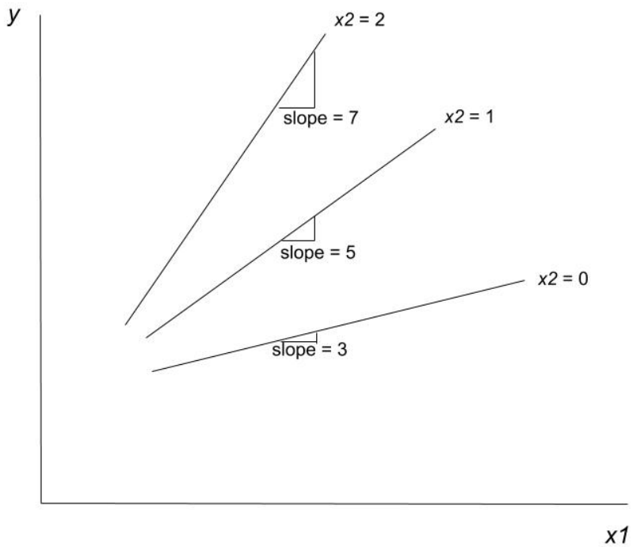
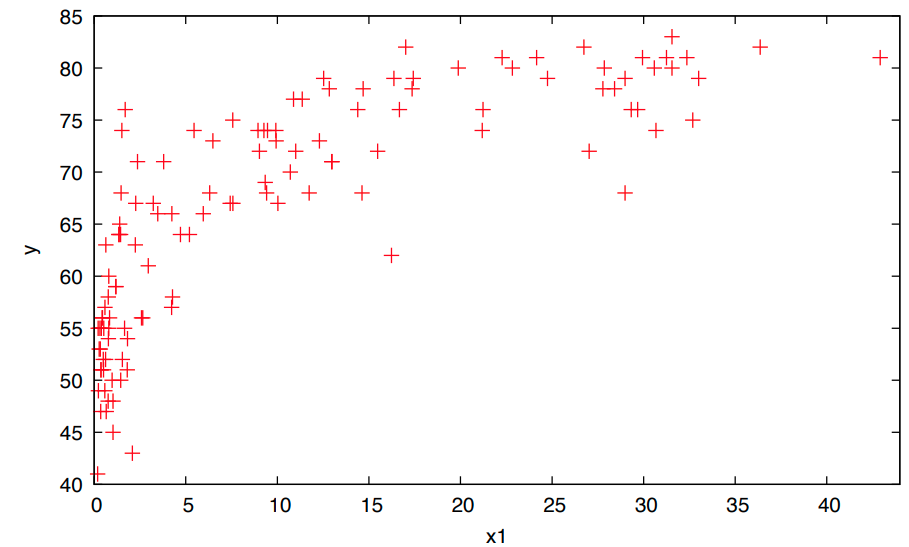
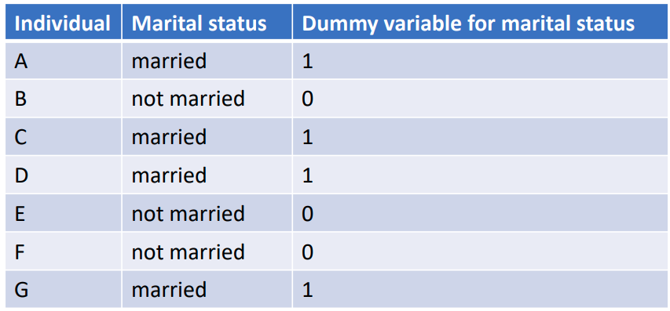

$$
\newcommand{\pr}{\text{I\kern-0.15em P}}
\newcommand{\Ha}{H_a}
\newcommand{\Ho}{H_0}
\newcommand{\pv}{\text{p-value}}
\newcommand{\ss}{\sum_{i=1}^{n}}
$$

# Notes

## Week 7
### Module 4 Week 7A

#### Interactions, 2nd Order Models, and Dummy Variables

##### Interactions

- Motivation: when the effect of one predictor variable on the outcome depends on the value of another predictor variable.

- When one $x$ varies and the others are held fixed, we get a set of parallel lines. 

    - *The relationship between $\mathbb{E}(y)$ and a given $x$ does not depend on the values of the other $x$'s.* 

- BUT: It is not uncommon, however, for the relationship between $\mathbb{E}(y)$ and a given $x$  to depend on the values of another $x$. 

    - E.g. $y$ - how much a family spend on vacation; $x_1$ - household income; $x_2$ - number of children in the household; we would expect that increase income leads to *more* vacation spending in households with *more* children.
    - In this case, an *interaction model* should be specified. 
    - An interaction model includes at least one **interaction term** which is *a predictor that is equal to the product of the $x$'s that interact with each other*.

    

- E.g. Suppose that the effect of $x_1$ on $y$ depends on the value of $x_2$.

    - $y = \beta_0 + \beta_1 x_1 + \beta_2 x_2 + \beta_3 x_1 x_2 + \epsilon$ 
    - Still a *linear* model, b/c $\beta$'s enter in a linear fashion.

- Estimate the model via *least squares*:

    - $\hat{y} = 4 + 3 x_1 − x_2 + 2 x_1 x_2$ 
        - When $x_2 = 0, \hat{y} = 4 + 3 x_1 $
        - When $x_2 = 1, \hat{y} = 3 + 3 x_1 + 2 x_1 = 3 + 5 x_1$
        - When $x_2 = 2, \hat{y} = 2 + 3 x_1 + 4 x_1 = 2 + 7 x_1$
            - Larger $x_2$ => larger effect of $x_1$ on $y$ (i.e $x_1$ and $x_2$ interact with each other)

        - The effect of $x_1$ on $y$ depends on the value of $x_2$ 
            - $\beta_1 + \beta_3 x_2$ 

        - The effect of $x_2$ on $y$ depends on the value of $x_1$
            - $\beta_2 + \beta_3 x_1$

    

    - 

        - To determine the *effect of the interaction term* is *statistically significant*: use the *standard T-Test*

            - BUT: if including the interaction term in the model, don't worry about the T-Test on individual coefficients of $x_1$ and $x_2$; regardless of their individual p-values, they should stay in the model.

            

##### 2nd Order Model

- Motivation: model non-linear relationships

- **Order of the model**: the largest exponent on any of the predictor variables; **2nd order model** (*Quadratic Model*): at least on predictor variable that is squared.

- Suppose we observe the following relationship between $x_1$ and $y$:

    - 

    

- We can model a *nonlinear* relationship: 

    - $y = \beta_0 + \beta_1 x_1 + \beta_2 x_1^2 + \epsilon$
        - $x_1$ interacts with itself => understanding of interaction terms can help interpretation: effect of $x_1$ on $y$ depends on $x_1$; effect of $x_1$ on $y$ depends on where $x_1$ is increasing from, a low or a high value.

- This is still a *linear regression model* because the $\beta$'s enter in a linear fashion, therefore, this model can be estimated via *least squares.* 

- Suppose we have the following estimates:

    - $\hat{y} = 55 + 2 x_1 − 0.04 x_1^2$

- $\beta_0$: intercept

- $\beta_1$: shift parameter 

- $\beta_2$: rate of curvature

    - Positive => the relationship changes with an increasing rate
    - Negative => the relationship changes with a decreasing rate

    

- 

    

- $y = \beta_0 + \beta_1 x_1 + \beta_2 x_1^2 + \epsilon$

- The coefficients themselves are not easily interpreted 

    - But use the interpretation trick (works for any *linear* or *non-linear regression model*): (1) plug in value $x_p$ and predict $\hat{y}_1$; (2) plug in value $x_p + 1$ and predict $\hat{y}_2$; (3) $\hat{y}_2 - \hat{y}_1$ is the *estimate for a one-unit change in $x$*!
    - BUT: be sure to *not to make predictions using $x$ values that are outside of the ones observed in the sample!*

- In general (using calculus), the effect of $x_1$ on $\mathbb{E}(y) = \beta_1 + 2 \beta_2 x_1$ 

    - Clearly seen: $\beta_1$ is a shift parameter, and the sign of $\beta_2$ determines the rate of change.

- The effect depends on where $x_1$ is increasing from.

- In our example, we have: $\hat{y} = 55 + 2 x_1 − 0.04 x_1^2$

- The effect of $x_1$ on $\mathbb{E}(y) = 2 - 0.08 x_1$ 

- For any regression model we can use the following approach to estimate the effect of a one-unit increase in a predictor of interest: 

    - Suppose we want to know the effect when $x_1$ increases from $10$ to $11$. 
    - @ $x_1 = 10$ →$\hat{y} = 55 + 2 * 10 - 0.04 (10^2) = 71$ 
    - @ $x_1 = 11$ → $\hat{y} = 55 + 2 *11 - 0.04 (11^2) = 72.16$
    - Effect when $x_1$ increases from $10$ to $11$ $= 72.16 - 71 = 1.16$

##### Dummy Variables

- Motivation: how to incorporate qualitative variables and interpret associated estimates.

- **Dummy Variables**: *Qualitative Variables* with only two categories.

- We often have qualitative variables as predictors

    - E.g. gender, marital status, race, region.

- There variables are not measured on a numerical scale but must be coded with numbers to use in a regression model. 

    - A $(0,1)$ coding scheme is most useful (to avoid confusion, use $1$ for the affirmative of the name)
    - 

    

- Interpretation; just plug in the values for the different categories:

    - $\mathbb{E}(y) = \beta_0 + \beta_1 x_1 $ (deterministic model)
    - E.g. $x_1 = $ marital status dummy variable 
        - $x_1 = 0$ -> not married 
        - $x_1 = 1$ -> married 
    - When $x_1 = 0$
        - $\mathbb{E}(y) = \beta_0$
    - When $x_1 = 1$
        - $\mathbb{E}(y) = \beta_0 + \beta_1$
    - The coefficient on the dummy variable ( $\beta_1$ in the above) is the *difference* in mean $\mathbb{E}(y)$ for someone who is married relative to someone who is not married.

    

- It is not uncommon for qualitative variables to have more than one category. 

- Let $c =$ the number of categories 

- In this case $(c - 1)$ dummy variables must be included. 

- The excluded category is the  “base category” 

- The estimated coefficients on the included dummies are the difference in $\mathbb{E}(y)$ between that category and the base category.

- *Important note:* cannot enter the model individual dummy variables (plus an intercept) for every category, because this leads to the *perfect multicolinearity* and we cannot get any estimates (the *dummy variable trap*)

    - Usually most software catches this for you and removes one of the categories to serve as the base category

    

- E.g. Suppose we have a qualitative variable for region and there are four regions: east, west, north, and south. 

- One category, it really doesn’t matter which, must serve as the base category. Let east be the base category. 

- There are 4 regions, so 3 dummy variables must be included for the other regions. 

- $\mathbb{E}(y) = \beta_0 + \beta_1 west + \beta_2 north + \beta_3 south$

- The easiest way to understand what the parameters measure is to plug in the appropriate values for each category. 

    - When east is the region, west=0, north=0, and south=0 -> $\mathbb{E}(y) = \beta_0$
    - When west is the region, west=1, north=0, and south=0 -> $\mathbb{E}(y) =\beta_0 + \beta_1$
    - When north is the region, west=0, north=1, and south=0 -> $\mathbb{E}(y) = \beta_0 + \beta_2$
    - When south is the region, west=0, north=0, and south=1 -> $\mathbb{E}(y) = \beta_0 + \beta_3$
    - The intercept ( $\beta_0$ ) is *the mean of the outcome in the east*. 
    - The coefficients on the dummies are the *difference in means between that category and the base.* 
        - E.g. $\beta_1$ - difference in the mean of $y$ between in the West vs. the East (the base category).
        - *Differences in means* across groups should sound familiar, this is equivalent to One-Way *ANOVA*.
            - Testing the *joint hypothesis* that the coefficients on the Dummy Variables are all $0$ produces same results as the ANOVA results for the differences in means across the regions.

    

- $\mathbb{E}(y) = \beta_0 + \beta_1 west + \beta_2 north + \beta_3 south$

- Assume $y = $ income

- Suppose we estimate the model above via *least squares* and obtain the following estimates: 

    - $\hat{y} = 59 -4 west + 6 north -5 south$
    - In the east: mean income = 59 
    - In the west: mean income = 59 – 4 = 55 
    - In the north: mean income = 59 + 6 = 65 
    - In the south: mean income = 59 – 5 = 54 

- $\Ho$: $\beta_1 = \beta_2 = \beta_3 = 0$

- $\Ha$: at least one $\beta \neq 0$

    - This is equivalent to the *ANOVA hypothesis test* we learned prior to introducing regression analysis
    - Note: $\beta_0$ intercept is missing from the test, because it is implicitly there since all other $\beta$'s are compared to the base category
