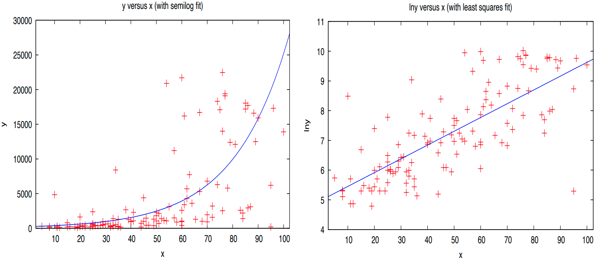
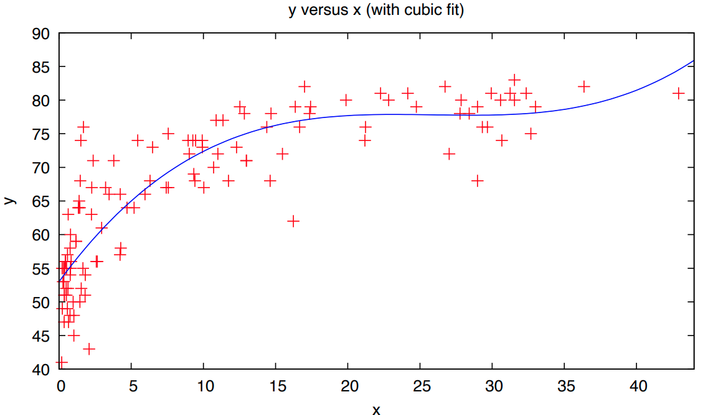
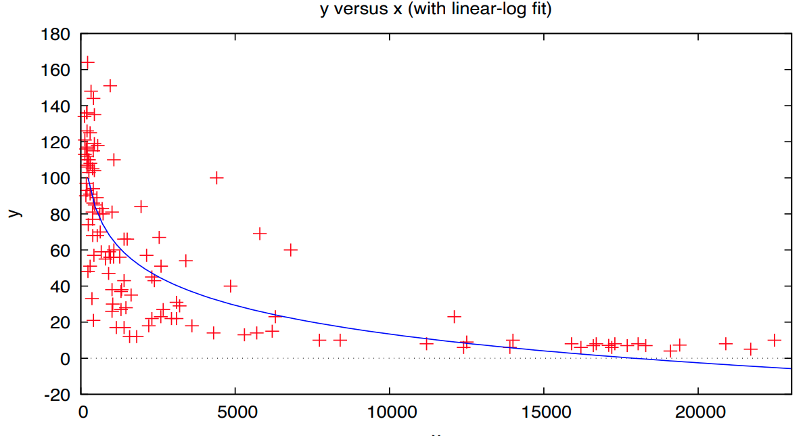

$$
\newcommand{\pr}{\text{I\kern-0.15em P}}
\newcommand{\Ha}{H_a}
\newcommand{\Ho}{H_0}
\newcommand{\pv}{\text{p-value}}
\newcommand{\ss}{\sum_{i=1}^{n}}
$$

# Notes

## Week 7
### Module 4 Week 7B

#### Additional Linear Regression Models

##### Multiplicative Models

- So far, we have had models of the form: $y = \mathbb{E}(y) + \epsilon$

    - There error term is additive (i.e. added to the mean/expected value of $y$ )

- Sometimes, it is useful to specify a model of the form: $y = \mathbb{E}(y) * \epsilon$

    - This is a **Multiplicative Model** or a **Log Model**, because the error term is multiplied to $\mathbb{E}(y)$. 

    - This is a useful model when the change in $y$ from a one unit increase in $x$ is best represented in *percentage* terms (e.g. want to predict percent change in salary or price of a product).

    - These models have also proven useful when the assumption of constant variance (*Homoscedasticity*) of the error term is violated. 

    

- E.g. Multiplicative model: $y = e^{\beta_0} e^{\beta_1 x_1} e^{\beta_2 x_2} e^{\epsilon}$

- This is a *nonlinear* regression model, however, it can be transformed into a *linear* model and then estimated via least squares. 

- Take the natural log (the inverse of $e^x$) of both sides of the equation: 

    - $ln(y) = \beta_0 ln(e) + \beta_1 x_1 ln(e) + \beta_2 x_2 ln(e) + \epsilon ln(e)$
    - $ln(e) = 1$
    - $ln(y) = \beta_0 + \beta_1 x_1 + \beta_2 x_2 + \epsilon$

- The *coefficients don’t have quite the same interpretation as before*. 

- In general, the coefficients measure the *percent* change in $y$ from a one-unit increase in $x$ 

    - $e^\hat{\beta_1} - 1 =$ the percent change in $y$ from a one-unit increase in $x_1$

    

- E.g. Suppose $y = salary$ and $x_1 =$ years of experience and we specify the following multiplicative model: 

    - $y = e^{\beta_0} e^{\beta_1 x_1} e^{\epsilon}$

- Transform to make the model linear: 

    - $ln(y) = \beta_0 + \beta_1 x_1 + \epsilon$

- Estimate via least squares: 

    - $\widehat{ln(y)} = 3 + 0.042 x_1$

- Interpretation of estimated coefficient: 

    - $(e^{0.042} - 1) = 0.043$ 
    - When years of experience increases by one-year salary increases by 4.3% 
    - Same interpretation for the *Multiple Linear Regression*; but remember the interpretation holds other predictors constant.

- We *cannot compare* $R^2$ from two models with different dependent variables (i.e. cannot compare $R^2$ in *Additive* vs. *Multiplicative* models because not the same dependent variables, $y$ vs. $ln(y)$)

    

- 

##### Polynomial Models

- *Wisdom: Software will never tell you if the specification of the model is wrong; as long as parameters are estimable, it will produce results, but they will be meaningless with bad specification. We need personal experience, knowledge, and theory and literature to guide the regression model specification.*

- Polynomial models (but beware of over-fitting!): 

- We’ve seen the quadratic model, which is a second-order polynomial model. 

- We can specify higher-order models. 

- In general, a $p^{th}$ order polynomial model allows the regression line (surface) to bend (or change directions) $(p − 1)$ times. 

- E.g. *cubic model (3rd order polynomial model)* (Note: with multiple $x$'s, you don't have to raise every predictor to the power of $3$):

    - $y = \beta_0 + \beta_1 x_1 + \beta_2 x_1^2 + \beta_3 x_1^3 + \epsilon$ 
    - $\beta_1$: shift parameter 
    - $\beta_2$: determines rate of curvature 
    - $\beta_3$: determines rate of reversal
    - The effect of a one-unit increase in $x_1 = \beta_1 + 2 \beta_2 x_1 + 3 x_1^2$
        - Interpretation: as with the *quadratic model*, the effect of $x_1$ depends on where it is increasing from

    

- E.g. Suppose the cubic model on the previous slide is estimated via least squares and we obtain the following results. 

    - $\hat{y}= 53 + 2.9 x_1 - 0.11 x_1^2 + 0.0015 x_1^3$

    - The effect of a one-unit change in $x_1$ depends on where $x_1$ is increasing from. 

    - E.g. what is the effect when $x_1$ increases from 10 to 11? 

    - @ $x_1 = 10$ → $\hat{y}= 53 + 2.9 (10) - 0.11 (10)^2 + 0.0015 (10)^3 = 72.5$

    - @ $x_1 = 11$ → $\hat{y}= 53 + 2.9 (11) - 0.11 (11)^2 + 0.0015 (11)^3 = 73.6$

    - The effect when $x_1$ increases from 10 to 11 $= 73.6 - 72.5 = 1.1$

        

    - 

        - Note: it can be unclear what order of the polynomial should be specified
            - plotting can help, but beware of over-fitting; you don't want to misrepresent the relationship in the underlying population of interest
            - Higher than 2nd order models are uncommon, but if theory and common sense suggest more than change in the direction, a higher order model may be appropriate
        - AGAIN: DO NOT MAKE PREDICTIONS OUTSIDE OF THE RANGE OF X VALUES IN THE SAMPLE!

        

- We can transform $y$ to help satisfy the assumption of the linear model as well as to provide a better fit. 

- We can also transform $x$'s, however, this is primarily done only to provide a better fit; not as a remedy for failed assumptions. 

- Transforming $x$ into $ln(x)$ can be useful when $y$ increases at a decreasing rate as $x$ increases, or vice versa. 

    - This is known as a **Linear-Log Model** 
    - $\frac{\hat{\beta}_1}{100} = $ *the change in $y$ from a 1% increase in $x_1$*

- Transforming $x$ into ( $1/x$ ) can be useful when $y$ increases (or decreases) at a decreasing rate as $x$ increases and approaches an asymptote. 

    - This is known as an **Inverse Model**
    - $\hat{\beta}_1 > 0$ indicates a negative relationship between $y$ and $x_1$.
    - $\hat{\beta}_1 < 0$ indicates a positive relationship between $y$ and $x_1$.

- Example of a Linear-Log Model: 

    - $y = \beta_0 + \beta_1 ln(x) + \epsilon$
    - $\hat{\beta}_1 < 0$ => Relationship between $y$ and $x$ is *decreasing* (but at an *increasing rate* as the slope of the blue curve becomes less and less negative)
    - No asymptote; keeps decreasing
    - 
    - If instead, we had $\hat{\beta}_1 > 0$ => The blue curve would be positive in slope, and the relationship would be *increasing* but at a *decreasing rate*.

- Example of a Inverse Model:

    - $\hat{\beta}_1 > 0$ => A positive coefficient in the inverse model gives rise to a *decreasing relationship* between $y$ and $x$
    - Looks similar to the Linear-Log Model previously, BUT: the difference is the Inverse Model has an asymptote at $\hat{y} = \hat{\beta}_0$ - a value that the function will never hit
    - 
