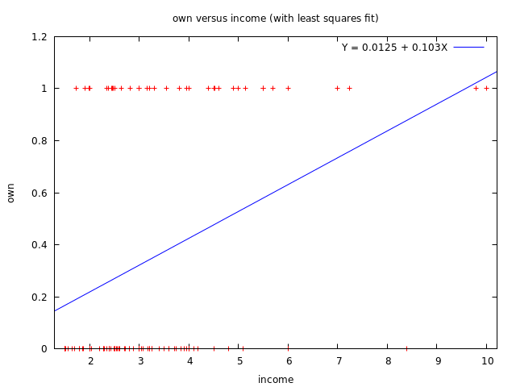
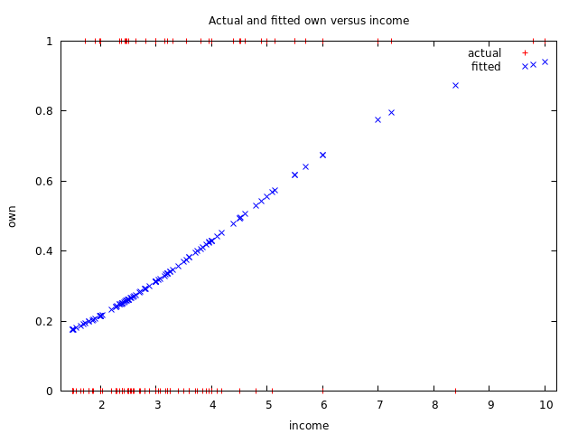

$$
\newcommand{\pr}{\text{I\kern-0.15em P}}
\newcommand{\Ha}{H_a}
\newcommand{\Ho}{H_0}
\newcommand{\pv}{\text{p-value}}
\newcommand{\ss}{\sum_{i=1}^{n}}
$$

# `gretl` Notes
## Week 8
### Module 4 Week 8

#### Linear Probability Model and Logistic Regression Model using gretl

- Dataset used: `Micro expenditure data.gdt`
  - Open with `File` -> `Open data` -> `User file...`
- Open up a new script editor: `File` -> `Script files` -> `New script` -> 
  `gretl script`
- We are interested in the relationship between home ownership (Y) and income (X)

##### Linear Probability Model

- Let's examine how changes in income impact the probability that someone owns their home
- Rename with a better name:
- ```
    ? rename ownrent own
    Listing 8 variables:
      0) const      1) derog      2) accept     3) age        4) income   
      5) expend     6) own        7) selfemp  
    ```
- EDA:
- ```
    ? freq own
    
    Frequency distribution for own, obs 1-100
    
              frequency    rel.     cum.
    
       0          64     64.00%   64.00% ***********************
       1          36     36.00%  100.00% ************
    ```
- ```
    ? summary income --simple
    
    Summary statistics, using the observations 1 - 100
    for the variable 'income' (100 valid observations)
    
      Mean                        3.3693
      Minimum                     1.5000
      Maximum                     10.000
      Standard deviation          1.6290
      Missing obs.                     0
    ```

    - Mean income is low at `3.3693`, but that's expected because the income is measured in units of `10000`, so this is equivalent to a mean income of `33693` Dollars for individuals in this sample

- Let's estimate a linear probability model: use the method of least squares to estimate the outcome of a dummy variable $Y$ which we modeled as a linear (i.e. linear in the coefficients) regression function

    - ```
        ? ols own const income
        
        Model 1: OLS, using observations 1-100
        Dependent variable: own
        
                     coefficient   std. error   t-ratio   p-value
          -------------------------------------------------------
          const       0.0125056    0.104846     0.1193    0.9053 
          income      0.103135     0.0280420    3.678     0.0004  ***
        
        Mean dependent var   0.360000   S.D. dependent var   0.482418
        Sum squared resid    20.24552   S.E. of regression   0.454518
        R-squared            0.121288   Adjusted R-squared   0.112322
        F(1, 98)             13.52688   P-value(F)           0.000384
        Log-likelihood      −62.03203   Akaike criterion     128.0641
        Schwarz criterion    133.2744   Hannan-Quinn         130.1728
        ```

    - $\mathbb{P}(own=1) = .0125 + .1031*income$ 

        - Interpretation (which is easy and is an advantage of a linear probability model): For a $10,000 increase in income, the probability that someone owns their home increases by .1031.

- ```
    ? gnuplot own income --fit=linear --output=display
    ```
- 

    - Interpretation: 
        - Clearly, a binary outcome; $y$ only takes on value of $1$ and $0$
        - Noticeable drawback: predictions falling outside of $0$ and $1$ probability values

- Let's make some predictions:

    - What is the predicted probability of home ownership for someone with an income of $20,000?:

        - ```
            ? eval $coeff(const) + ($coeff(income) * 2)
            0.2187766
            ```

        - $2$ because income measured in $10000$ so this is equivalent to 20000 USD

        - The predicted probability is .219

    - What about someone with an income of $50,000?:

        - ```
            ? eval $coeff(const) + ($coeff(income) * 5)
            0.52818302
            ```

        - The predicted probability is .528

    - What about someone with an income of $100,000?

        - ```
            ? eval $coeff(const) + ($coeff(income)*10)
            1.0438604
            ```

        - The predicted probability is 1.043

            - => Nonsensical probability value!


##### Logit (Logistic Regression) Model

- ```
    ? logit own const income
    
    Model 2: Logit, using observations 1-100
    Dependent variable: own
    Standard errors based on Hessian
    
                 coefficient   std. error     z       slope  
      -------------------------------------------------------
      const       −2.30079      0.598817    −3.842           
      income       0.505045     0.164518     3.070   0.115575
    
    Mean dependent var   0.360000   S.D. dependent var   0.482418
    McFadden R-squared   0.095499   Adjusted R-squared   0.064890
    Log-likelihood      −59.10177   Akaike criterion     122.2035
    Schwarz criterion    127.4139   Hannan-Quinn         124.3123
    
    Number of cases 'correctly predicted' = 72 (72.0%)
    f(beta'x) at mean of independent vars = 0.229
    Likelihood ratio test: Chi-square(1) = 12.4801 [0.0004]
    
               Predicted
                 0    1
      Actual 0  60    4
             1  24   12
    ```

- Interpretation:

    - `income`'s coefficient of `0.505045` gives the change in *log-odds*, which is hard to interpret => instead:

    - ```
        ? eval (exp(.505045) - 1) * 100
        65.706009
        ```

    - For a $10,000 increase in income, the odds of home ownership increase by 65.71%

    - `slope` of `0.115575` interpretation: 

        - This is what we want to know, the *Marginal Effect*: the change in predicted probability from a one-unit-increase in income when increasing from its mean value
        - When income increases by $10,000 from its mean value, the predicted probability of home ownership increases by .12

    - `McFadden R-squared` is a Pseudo $R^2$ to give us a sense of how much additional prediction power when estimated the model with the X variables rather than just an intercept; but not a linear model, so *not* the $R^2$ we're used to

- Prediction - *Use the Logit Model Form*:

    - Predicted probability of home ownership for someone with an income of \$20,000

        - ```
            ? eval 1/(1+exp(-($coeff(const) + ($coeff(income)*2))))
            0.21573438
            ```

        - The predicted probability is .22

    - For someone with an income of \$50,000?

        - ```
            ? eval 1/(1+exp(-($coeff(const) + ($coeff(income)*5))))
            0.5558742
            ```

        - The predicted probability is .56; still quite similar to the *Linear Probability Model*

    - For someone with an income of \$100,000?

        - ```
            ? eval 1/(1+exp(-($coeff(const) + ($coeff(income)*10))))
            0.93989401
            ```

        - The predicted probability is .94 <- better than the *Linear Probability Model*; still under 1

    - Should be careful about out-of-sample range predictions, but let's demonstrate that the Probability values still make sense:

    - For someone with an income of \$200,000?

        - ```
            ? eval 1/(1+exp(-($coeff(const) + ($coeff(income)*20))))
            0.99959048
            ```

        - The predicted probability is .99

    - For someone with an income of \$1,000,000?

        - ```
            ? eval 1/(1+exp(-($coeff(const) + ($coeff(income)*100))))
            1
            ```

        - The predicted probability is .99999999 (`gretl` rounded it up)

    - => Fixed the out-of-range prediction issue with the *Logit Model*

- Interpret the *Classification Table*:

    - Out of `64` of those who do not own their home, we predict `60` of them correctly:

        - ```
            ? eval 60/64
            0.9375
            ```

        - We correctly classified 93.75% of the 0's

    - Out of `36` of those who *do* own their home, we predict `12` of them correctly:

        - ```
            ? eval 12/36
            0.33333333
            ```

        - We correctly classified 33.33% of the 1's

    - => We do a better job predicting `0`'s than `1`'s

    - We correctly classified 72% (`72 / 100`) of all observations in the sample (overall accuracy)

- Get graphs:

    - ```
        ? m1 <- logit own const income
        
        m1: Logit, using observations 1-100
        Dependent variable: own
        Standard errors based on Hessian
        
                     coefficient   std. error     z       slope  
          -------------------------------------------------------
          const       −2.30079      0.598817    −3.842           
          income       0.505045     0.164518     3.070   0.115575
        
        Mean dependent var   0.360000   S.D. dependent var   0.482418
        McFadden R-squared   0.095499   Adjusted R-squared   0.064890
        Log-likelihood      −59.10177   Akaike criterion     122.2035
        Schwarz criterion    127.4139   Hannan-Quinn         124.3123
        
        Number of cases 'correctly predicted' = 72 (72.0%)
        f(beta'x) at mean of independent vars = 0.229
        Likelihood ratio test: Chi-square(1) = 12.4801 [0.0004]
        
                   Predicted
                     0    1
          Actual 0  60    4
                 1  24   12
        
        m1 saved
        ```

    - Go to `Icon view` -> Double click on `m1`

        - -> `Graph` -> `Fitted, actual plot` -> `Against income` :
            - 
            - Blue is the probability predictions

- GUI way:

    - `Model` -> `Limited dependent variable` -> `Logit` -> `Binary` -> `own` for `Dependent variable`; `const` and `income` for `Regressors` 
    - Choose `Show slopes at means` : display marginal effect at the mean; *the change in predicted Probability that Y = 1 from a one unit increase in X from its mean value*
    - Choose `Show p-values`: to determine if coefficients are statistically significant


