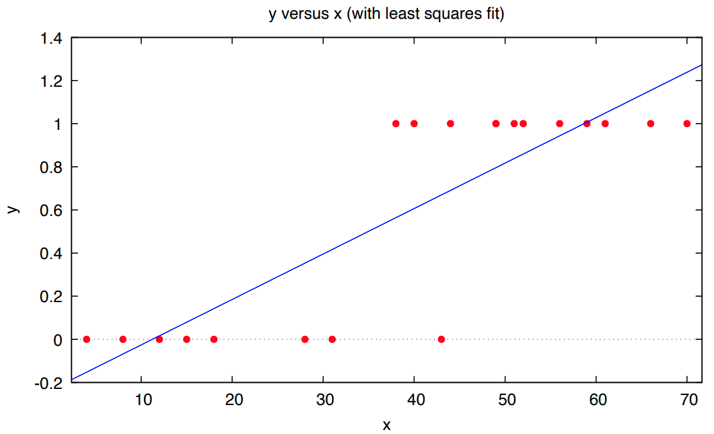
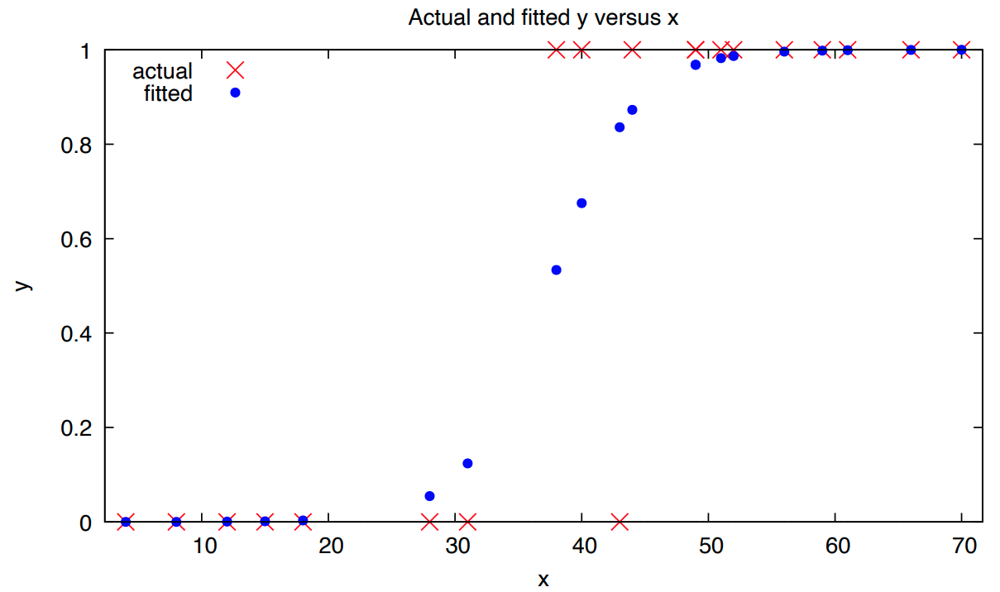
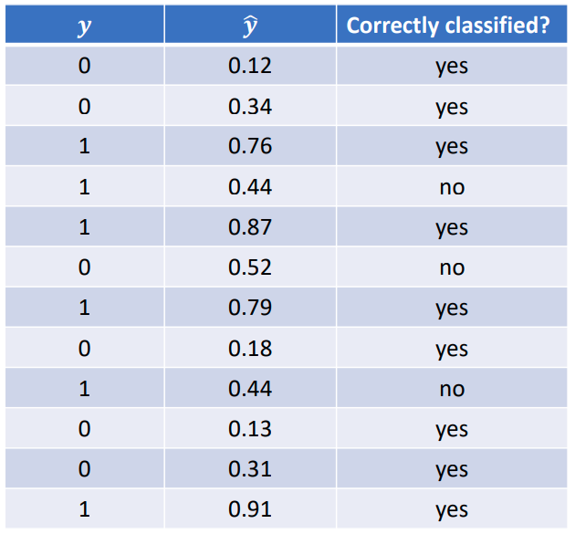

$$
\newcommand{\pr}{\text{I\kern-0.15em P}}
\newcommand{\Ha}{H_a}
\newcommand{\Ho}{H_0}
\newcommand{\pv}{\text{p-value}}
\newcommand{\ss}{\sum_{i=1}^{n}}
$$

# Notes

## Week 8
### Module 4 Week 8A

#### Qualitative Dependent Variable and Logistic Regression

- It is not uncommon for the dependent variable of interest to be a dummy variable.

- E.g. how does income ( $x$ ) relate to whether someone votes ( $y$ )? 

- $y = \beta_0 + \beta_1 x_1 + \epsilon$

    - Where $y = 0$ if person did not vote and $y = 1$ if person did vote. 

- This is a linear model and can be fit to the data using least squares. 

    - This is known as the *linear probability model* 

- The predicted values ( $\hat{y}$ ) are interpreted as the *predicted probability that $y = 1$.*

    

- Suppose the linear probability model on the previous slide is estimated via least squares producing the following results: 

    - $\hat{y} = 0.07 + 0.02 x_1$

- Interpretation of $\hat{\beta}_1$: when income increases by one-unit the predicted probability that someone votes increases by $0.02$. 

- What is the predicted probability that someone with an income of $20$ votes? 

    - $\hat{y} = 0.07 + 0.02 (20) = 0.47$

- What is the predicted probability that someone with an income of 50 votes? 

    - $\hat{y} = 0.07 + 0.02 (50) = 1.07$
        - What does it mean for a probability to be greater than 1? This is nonsensical.

    

- 

- Problems arise using least squares when $y$ is a dummy variable. 

    1. Error term is not normally distributed 
    2. Variance of error term is not constant 
    3. Nonsensical predicted values (i.e. predicted probabilities) 

- Using a logistic regression model (often called a logit model) is a common approach to help circumvent these problems, especially problem 3. 

- A logistic model uses a nonlinear functional form to force the predicted probabilities within the meaningful $(0, 1)$ range. 

    

- $\mathbb{E}(y) = \frac{e^{\beta_0 + \beta_1 x_1}}{1 + e^{\beta_0 + \beta_1 x_1}} = \mathbb{P}(y = 1) = \pi$

- $\mathbb{E}(y)$ cannot go below $0$ or above $1$ 

- This model is *nonlinear* in the parameters, and therefore, cannot be estimated via least squares.

- The model can be transformed into a linear one: 

    - $ln(\frac{\pi}{1 - \pi}) = \beta_0 + \beta_1 x_1$
        - This is known as a *“log-odds model”*
    - This approach (i.e. transforming and using least squares) is not recommended. 

- The standard approach is to estimate using *maximum likelihood*

    

- 

    

- The estimated parameters in a logit model represent the change in the log- odds from a one-unit increase in $x$, holding other $x$'s constant. 

- Usually ( $e^{\hat{\beta_1} - 1}$ ) is calculated, to give the percent change in odds from a one-unit increase in $x$. 

- Example for model with two $x$'s: 

    -  $\hat{\beta}_1 = −0.7553 → e^{-.7553} - 1 = -0.53 $
        - For a one-unit increase in $x$, the odds decrease by 53%, holding $x_2$ constant. 
    -  $\hat{\beta}_1 = 0.33 → e^{0.33} - 1= 0.39 $
        - For a one-unit increase in $x_2$, the odds increase by 39%, holding $x_1$ constant. 

- Marginal effects can also be calculated which measure the change in the predicted probability that $y = 1$ from a one-unit increase in $x$.

    

- Model parameters are tested using Chi-squared tests. 

- Testing overall model adequacy (e.g. with two $x$'s) 

    - $\Ho$: $\beta_1 = \beta_2 = 0$
    - $\Ha$: at least one $\beta \neq 0$
    - Test statistic is Chi-squared with $k$ (i.e. # of $x$'s') *df*

- Testing individual parameters 

    - $\Ho$: $\beta_1 = 0$
    - $\Ha$: $\beta_1 \neq 0$
    - Test statistic is Chi-squared with 1 *df*

    

- There is no $R^2$ because the logit model is not linear. However, there are measures of fit. 

- Pseudo-$R^2$

- Classification tables help assess the usefulness of the model. 

    - Percentage of observations correctly classified. 
    - Correctly classified if $y = 1$ and $\hat{y} > 0.50$
        - Sensitivity 
    - Correctly classified if $y = 0$ and $\hat{y} < 0.50$ 
        - Specificity

    

- 

- Correctly classified (overall) $= (9/12)*100 = 75$%

- Sensitivity $= (4/6) * 100 = 66.7$% 

- Specificity $= (5/6) * 100 = 83.3$%
